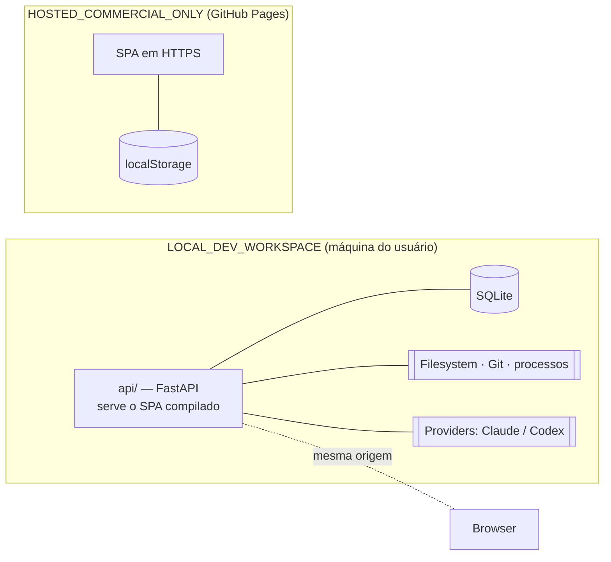
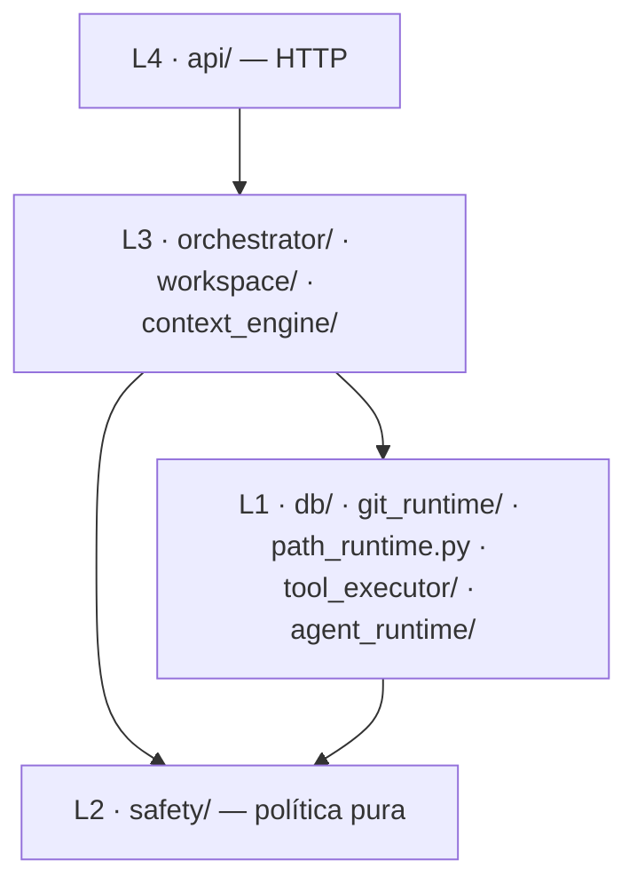

# 01 — Arquitetura V1

> Escopo: fronteiras de módulo, direção de dependências, composition root e contrato
> frontend ↔ backend. Decisões relacionadas:
> [ADR-0001](../adr/0001-local-backend-fastapi-sqlite.md),
> [ADR-0002](../adr/0002-disjoint-persistence.md),
> [ADR-0009](../adr/0009-provider-capability-enforcement.md).
>
> **Revisado na Fase 1B.1** (AUD-001, AUD-006, AUD-012) e na **Fase 1B.3**
> (REAUD-003, REAUD-004, REAUD-006).

## 1. Visão geral

Duas peças, um produto, **dois modos de execução**.



O backend **não conhece** o domínio comercial: não importa tipos de
`Client`/`Proposal`/`Project`, não lê `localStorage`, não resolve `linked_project_id`.

## 2. Estrutura de módulos

```text
api/
  app/
    main.py              # composition root: resolve e injeta as implementações
    config.py            # settings; único ponto que lê ambiente e segredos
    api/                 # camada HTTP: routers sob /api + schemas Pydantic
    db/                  # engine, sessão, unit of work e TODAS as tabelas
    workspace/           # DevWorkspace: serviço, repositórios, seed de contexto
    context_engine/      # registry, router, hashing, manifest, rendered artifact
    orchestrator/        # analyzer, resource router, planner, execution manager
    tool_executor/       # NOVO (1B.1) — único executor de efeitos colaterais de agente
    agent_runtime/       # adaptadores de provider e test runner
    safety/              # política pura e determinística — zero IO
    path_runtime.py      # NOVO (1B.3) — IO de filesystem que produz PathFacts
    git_runtime/         # adaptador de git e ciclo de vida de worktree
    metrics.py           # leitura e agregação
  tests/
  migrations/
  pyproject.toml
```

### Correções em relação à proposta original da Fase 1B

| Correção | Motivo |
| --- | --- |
| **`db/`, `api/`, `config.py` acrescentados** | A proposta não tinha onde morar engine/sessão/tabelas, routers, nem o ponto único de leitura de segredos. |
| **`metrics/` → `metrics.py`** | Com métricas como colunas tipadas ([ADR-0007](../adr/0007-metrics-as-typed-columns.md)), sobra agregação: três a quatro funções. |
| **`tool_executor/` acrescentado (1B.1)** | Resposta ao AUD-001. Separa *raciocínio do provider* de *efeitos colaterais*. É o único componente que executa ações de agente sobre filesystem e git. |
| **`path_runtime.py` acrescentado (1B.3)** | Resposta ao REAUD-004. `safety/` era declarado puro, mas validar path exige IO real (canonicalizar, inspecionar reparse points, abrir handles, comparar identidade). O IO sai para cá e devolve `PathFacts`; `safety/` volta a ser só decisão. Um módulo basta — não é pacote. |
| **`safety/` e `git_runtime/` mantidos separados** | `safety/` decide (puro); `git_runtime/` age (efeito). Fundir contaminaria a política com `subprocess` e destruiria a testabilidade determinística. |
| **Test Runner dentro de `agent_runtime/`** | Mesmo problema — supervisionar processo externo sob política. **(1B.3)** Fica claro que ele é **infraestrutura do sistema, não ferramenta do Developer**: o agente não o invoca, direta nem indiretamente. Ver o risco declarado em [04](04-safety-and-git-runtime.md) §6. |

### Contrato por módulo

#### `safety/` — política pura

| | |
| --- | --- |
| **Responsabilidade** | **Receber fatos e decidir.** Nunca coleta os fatos. Decide sobre path (a partir de `PathFacts`), comando, capability e limites. |
| **Pode importar** | stdlib e Pydantic. |
| **NÃO pode importar** | `db`, `git_runtime`, **`path_runtime`**, `tool_executor`, `agent_runtime`, `orchestrator`, `api`, FastAPI, SQLAlchemy, `subprocess`, `os` para IO. |
| **Interface pública** | `SafetyPolicy`, `PathFacts` (tipo), `policy_hash(policy)`, `prevalidate_path_syntax(str)`, `decide_path(PathFacts)`, `decide_post_open(PathFacts)`, `evaluate_command`, `evaluate_capability_profile`, `evaluate_limits`, `validate_source_ref`, `redact`. |
| **Nota** | Não persiste `SafetyEvent`: devolve `SafetyDecision`, quem chamou registra. Dividido em **Safety Kernel** (E2) e **Full Safety Runtime** (E7) — ver [07](07-roadmap-v1.md). |

#### `path_runtime.py` — coleta de fatos de filesystem *(novo em 1B.3)*

| | |
| --- | --- |
| **Responsabilidade** | Todo o IO de path: canonicalização, inspeção de symlink/junction/reparse point, aquisição de handle, identidade de objeto, verificação pós-abertura. **Produz `PathFacts`; não decide nada.** |
| **Pode importar** | `safety` (apenas os tipos), `config`, stdlib. |
| **NÃO pode importar** | `db`, `git_runtime`, `tool_executor`, `agent_runtime`, `context_engine`, `orchestrator`, `api`. |
| **Interface pública** | `SafePathRuntime.inspect(requested, root) -> PathFacts`, `SafePathRuntime.open_checked(...)`, `SafePathRuntime.inspect_opened(handle) -> PathFacts`. |
| **Nota** | Escrita ou truncamento **nunca** ocorrem antes da decisão pós-abertura. Ver [04](04-safety-and-git-runtime.md) §4. |

#### `tool_executor/` — único executor de efeitos de agente *(novo em 1B.1)*

| | |
| --- | --- |
| **Responsabilidade** | Receber `ToolRequest` **tipado** de um provider, coletar fatos via `path_runtime`, submetê-los a `safety`, executar o efeito permitido e devolver `ToolResult`. Medir, de forma autoritativa, o que foi lido e escrito. |
| **Pode importar** | `safety`, `path_runtime`, `git_runtime`, `config`, stdlib. |
| **NÃO pode importar** | `db`, `agent_runtime`, `orchestrator`, `context_engine`, `api`. |
| **Interface pública** | `ToolExecutorFactory.create(...) -> ToolExecutor`, `ToolExecutor.execute(ToolRequest) -> ToolResult`, `ToolExecutor.usage() -> MediatedUsage`. |
| **Nota** | **(1B.3)** O composition root injeta a **factory**, não uma instância. O `ToolExecutor` tem **escopo de run** e é criado com `ExecutionWorkspaceRef`, política composta, perfil de capability efetivo e metadados de task/run. Nenhum executor atravessa runs. Não expõe `ExecCommand` genérico. |

#### `git_runtime/` — adaptador Git

| | |
| --- | --- |
| **Responsabilidade** | Preflight, ciclo de vida de worktree, diff, divergência de working tree, reconciliação de worktrees órfãs. **Fonte autoritativa de `files_changed` e `diff_stat`.** |
| **Pode importar** | `safety`, `config`, stdlib. |
| **NÃO pode importar** | `db`, `orchestrator`, `agent_runtime`, `context_engine`, `api`. |
| **Interface pública** | `preflight`, `resolve_base_commit`, `working_tree_status`, `create_worktree`, `remove_worktree`, `list_worktrees`, `diff`, `changed_files`. |
| **Nota** | Nunca executa `commit`, `merge`, `push`, `rebase` ou `reset --hard`. |

#### `agent_runtime/` — adaptadores de provider e test runner

| | |
| --- | --- |
| **Responsabilidade** | Implementar `DeveloperProvider`, `AuditorProvider` e `TestRunner`; declarar e **provar** o `ProviderCapabilityProfile` efetivo; supervisionar processos com timeout e cancelamento. |
| **Pode importar** | `safety`, `tool_executor`, `config`, stdlib, SDKs/CLIs de provider. |
| **NÃO pode importar** | **`db`**, `orchestrator`, `context_engine`, `api`. |
| **Interface pública** | Ver [05](05-provider-contracts.md). |
| **Nota** | **(1B.3)** O Developer tem `execute_commands = disabled`: seus efeitos passam pela superfície mediada e fechada do `tool_executor`. O **Test Runner é infraestrutura do sistema**, governado por `TestPolicy` — não é ferramenta do Developer. Adaptador que não prova o perfil exigido **recusa a execução** (fail closed). |

#### `context_engine/` — conhecimento do workspace

| | |
| --- | --- |
| **Responsabilidade** | CRUD de `ContextRegistryEntry`, hashes, *staleness*, file map, seleção determinística, `ContextManifest` e **Rendered Context Artifact**. |
| **Pode importar** | `db`, `git_runtime` (leitura), `path_runtime`, `safety`, `config`. |
| **NÃO pode importar** | **`agent_runtime`**, `tool_executor`, `orchestrator`, `api`. |
| **Interface pública** | `list_entries`, `upsert_entry`, `verify_freshness`, `build_file_map`, `select_context`, `freeze_manifest`, `render_context`. |

#### `workspace/` — agregado DevWorkspace

| | |
| --- | --- |
| **Responsabilidade** | CRUD de `DevWorkspace`, validação de `local_path`, arquivamento, prévia e execução de purga, importação do seed. |
| **Pode importar** | `db`, `safety`, `path_runtime`, `git_runtime`, `context_engine`, `config`. |
| **NÃO pode importar** | `orchestrator`, `agent_runtime`, `tool_executor`, `api`. |

#### `orchestrator/` — decisão e execução

| | |
| --- | --- |
| **Responsabilidade** | Task Analyzer, Resource Router, Execution Planner, Execution Manager. Dono da máquina de estados e **dono da transação**. |
| **Pode importar** | `db`, `context_engine`, `git_runtime`, `safety`, `workspace` (leitura), `config`. **Recebe** `DeveloperProvider`, `AuditorProvider`, `TestRunner` e `ToolExecutorFactory` **por injeção** — não os procura. |
| **NÃO pode importar** | `api`; **não importa adaptadores concretos de provider**. |
| **Nota** | Único módulo que escreve `WorkspaceTask`, `Run`, `AuditFinding` e `SafetyEvent`. |

#### `api/` — camada HTTP

| | |
| --- | --- |
| **Responsabilidade** | Rotas sob `/api`, validação, serialização, autorização local, streaming de progresso, e — em modo local — servir o SPA compilado. |
| **Pode importar** | `workspace`, `context_engine`, `orchestrator`, `config`, `db` (dependência de sessão). |
| **NÃO pode importar** | `agent_runtime`, `tool_executor`, `git_runtime` diretamente. |

## 3. Composition root e direção de dependências

### Composition root *(corrige AUD-012)*

`main.py` é o **único** lugar que conhece implementações concretas. No startup ele lê
`config.py` e constrói:

```text
SafetyPolicy            ← config (global + override por workspace, só restritivo)
SafePathRuntime         ← config
ToolExecutorFactory     ← policy base + path_runtime + git_runtime
DeveloperProvider       ← adaptador concreto (ex.: claude-cli)
AuditorProvider         ← adaptador concreto (ex.: codex-cli)
TestRunner              ← adaptador concreto + TestPolicy
```

e injeta as **interfaces** no Execution Manager.

> **(1B.3, REAUD-006)** O composition root injeta a **`ToolExecutorFactory`**, nunca um
> `ToolExecutor` concreto global — o executor depende de `ExecutionWorkspaceRef`, política
> composta, perfil de capability efetivo e metadados de task/run, que só existem em tempo
> de execução.
>
> | Escopo | Objeto |
> | --- | --- |
> | Vida da aplicação | `ToolExecutorFactory` |
> | **Vida do run** | `ToolExecutor`, criado por `factory.create(...)` |

O Orchestrator não faz lookup, não consulta registry e não conhece nome de fornecedor.
Trocar CLI por API é mudança de configuração no composition root, sem tocar em orquestração.

### Camadas



Dentro de L1 há uma ordem interna sem ciclo:
`agent_runtime → tool_executor → {path_runtime, git_runtime}`, e todos → `safety`.

### Dependências proibidas

| Proibido | Por quê |
| --- | --- |
| `context_engine` → `agent_runtime` / `tool_executor` | O Context Engine não conhece provider nem executa efeito. |
| `safety` → qualquer módulo do projeto, **inclusive `path_runtime`** | Política com IO não é auditável nem determinística. A dependência é só `path_runtime → safety`, para os tipos. |
| `path_runtime` → `db` / `tool_executor` / `agent_runtime` / `orchestrator` / `api` | Coleta fatos e nada mais. |
| `agent_runtime` → `db` · `git_runtime` → `db` · `tool_executor` → `db` | O Execution Manager é o dono da transação. |
| `tool_executor` → `agent_runtime` | Criaria ciclo; o executor não conhece quem o chama. |
| `db` → módulos de aplicação | Inverteria a direção. |
| `api` → `agent_runtime` / `tool_executor` / `git_runtime` | Rota não executa processo nem git. |
| **`orchestrator` → adaptador concreto de provider** | Neutralidade de provider; resolução só no composition root. |
| qualquer módulo → domínio comercial | [ADR-0002](../adr/0002-disjoint-persistence.md). |
| LLM → decisão de segurança | Ver [04](04-safety-and-git-runtime.md). |

Verificado por `api/tests/test_architecture.py`, que percorre os `import` com `ast`.

## 4. Fronteira frontend ↔ backend

### Divisão de responsabilidades

| Frontend | Backend |
| --- | --- |
| Domínio comercial em `localStorage` | Nada do domínio comercial |
| UI de workspaces, contexto, tarefas, planos, aprovações, execuções, métricas | Filesystem, SQLite, Git, processos, providers, política |
| Resolve `linked_project_id` → `Project` | Guarda a string opaca |
| Envia o seed de `ProjectPlanning` como payload | Recebe JSON anônimo |
| — | Nunca commita, nunca faz merge, nunca faz push |

### Modos de execução *(corrige AUD-006 e §11 da auditoria)*

| Modo | Como é determinado | Comportamento |
| --- | --- | --- |
| **`LOCAL_DEV_WORKSPACE`** | Build local (`npm run dev` com proxy, ou build servido pelo backend) | O **backend serve o SPA compilado** → mesma origem. Em desenvolvimento, o Vite faz **proxy de `/api`** para a FastAPI → também mesma origem do ponto de vista do browser. |
| **`HOSTED_COMMERCIAL_ONLY`** | Build do GitHub Pages | Fluxo comercial completo. A área de AI Dev Workspace renderiza estado "disponível apenas na execução local". |

No desenvolvimento, o token não aparece por mágica no HTML servido pelo Vite. O
*launcher* local inicia a FastAPI, recebe o token **somente em memória** e inicia o Vite
com um canal privado de processo (variável sem prefixo `VITE_`, nunca escrita em `.env`).
Um `transformIndexHtml` local injeta a mesma `<meta>` e configura `Cache-Control:
no-store`; a variável não entra no bundle nem é impressa. O proxy encaminha `/api` para a
instância que emitiu aquele token. A única alternativa suportada é usar o build compilado
servido diretamente pela FastAPI. Não existe endpoint HTTP de bootstrap em nenhum dos
dois fluxos. Como serve HTML autenticador, o Vite dev também fica em `127.0.0.1`, com
hosts permitidos explícitos e CORS negado; não se confia nos defaults da ferramenta.

**O modo é fixado em build time**, por variável de build. No GitHub Pages a aplicação
**não faz nenhuma tentativa de rede contra localhost** — nem uma. Isso elimina, na raiz,
requisições cross-origin para loopback, mixed content, *Private Network Access*, retries e
ruído de console.

No modo local, a sonda a `GET /api/health` existe apenas como **indicador de saúde**: uma
única chamada memoizada por sessão, timeout curto, sem retry automático.

### Segurança da API local

Com mesma origem, o desenho fica simples e mais forte:

1. **Bind em `127.0.0.1`**, nunca `0.0.0.0`.
2. **Validação de `Host`** contra `127.0.0.1:<porta>` / `localhost:<porta>` — defesa contra
   DNS rebinding.
3. **Validação de `Origin` / `Sec-Fetch-Site`** — requisições que alteram estado exigem
   mesma origem.
4. **CORS negado nos dois fluxos locais.** O proxy de desenvolvimento é server-side e não
   exige headers CORS; somente a validação de `Origin` conhece a origem fixa do Vite.
   Nunca `*`.
5. **`LocalSessionToken` obrigatório em todas as rotas exceto `GET /api/health`.**

#### `LocalSessionToken`

| Propriedade | Definição |
| --- | --- |
| Geração | aleatório forte (≥ 256 bits) no startup do backend |
| Rotação | a cada reinício do backend (V1); efêmero, nunca persistido em disco |
| **Bootstrap** | **(1B.3) injetado no HTML inicial**, como `<meta name="ff-session-token" content="…">`: pela FastAPI no build compilado; pelo `transformIndexHtml` alimentado em memória pelo launcher no Vite dev. **Não existe rota de bootstrap.** |
| Cache | o HTML inicial é servido com `Cache-Control: no-store` |
| Leitura no cliente | o SPA copia para memória no boot e **remove a `<meta>` do DOM** em seguida |
| Armazenamento no cliente | **memória apenas** — nunca `localStorage`, nunca `sessionStorage`, nunca cookie |
| Transporte | header `Authorization: Bearer …` |
| Proibido | em URL, query string, fragmento, log, mensagem de erro ou métrica |

> **(1B.3, REAUD-003)** A rota `/api/session/bootstrap` foi **eliminada**. Ela seria uma
> segunda rota sem autenticação, contradizendo a regra de que só `GET /api/health` é
> aberta. Como o HTML é transformado no servidor em ambos os fluxos locais — FastAPI no
> build compilado, Vite no dev — injetar o token ali dispensa a rota inteira. **`GET
> /api/health` é a única rota não autenticada — não existe segunda.**

**Por que header e não cookie:** cookie é anexado automaticamente pelo browser, o que
recriaria a necessidade de token anti-CSRF. Um header exigido, obtenível apenas pelo HTML
de mesma origem, resolve CSRF por construção.

**Aba maliciosa:** não consegue ler o token — ele vive no HTML de mesma origem, que o CORS
impede outra origem de ler —, não consegue forjar o header (CORS nega o preflight), e não
há cookie para carregar automaticamente.

**Streaming:** `EventSource` **não** envia headers customizados. O progresso usa
**SSE consumido via `fetch` + `ReadableStream`**, que carrega o `Authorization`. Nenhuma
rota aceita token por query string para contornar isso.

### O que NUNCA atravessa para o browser

| Nunca sai do backend | Substituto |
| --- | --- |
| Chaves de API, tokens e credenciais de provider | Nada, nem mascarado |
| `LocalSessionToken` em log, erro ou métrica | Redigido |
| Conteúdo de `.env*`, `*.pem`, `*.key`, `.git-credentials`, `secrets/**` | O manifest registra `excluded: [{path, reason}]` — caminho, nunca conteúdo |
| Paths absolutos fora do workspace | Paths relativos; exceção única: o `local_path` que o próprio usuário digitou |
| `argv` completo e env do processo filho | Rótulo sanitizado (`"npm test"`) |
| `stdout`/`stderr` crus | Texto redigido; log completo em arquivo local referenciado por id |
| Raciocínio privado / *chain-of-thought* | `summary` curto do resultado |
| Remotes com credencial embutida | URL redigida |
| Stack traces internos | `{code, message}` estável |

### Onde a redação se aplica — e onde não *(precisão exigida pelo REAUD-003)*

O redator de segredos é **um só** e vive em `safety/`. Ele roda em três pontos:

1. **seleção de contexto** — antes de um bloco entrar no artefato renderizado;
2. **persistência de log** — antes de qualquer texto ir para `data_dir`;
3. **serialização de resposta de API** — todo corpo JSON de `/api/*`.

**Exceção explícita:** o `LocalSessionToken` injetado no HTML inicial **é parte do
bootstrap local e não passa pela redação de resposta de API** — ele não é uma resposta de
API, e redigi-lo o tornaria inútil. A proteção dele é outra: mesma origem,
`Cache-Control: no-store`, memória apenas, e **jamais em log**. A frase "toda resposta
passa pelo redator" era imprecisa e foi substituída por esta.

## 5. O que esta arquitetura deliberadamente não tem

- Sem autenticação de usuário — máquina única, loopback, token de sessão local.
- Sem fila distribuída, worker externo, Redis ou Celery — `max_parallel_agents = 1`.
- **Sem sandbox de sistema operacional na V1.** Ver o limite declarado em
  [04](04-safety-and-git-runtime.md) §0 e §6.
- **Sem execução de comandos pelo Developer** — `execute_commands = disabled`, sem exceção
  ([ADR-0009](../adr/0009-provider-capability-enforcement.md)).
- Sem Docker na V1 — estudo de isolamento fica em E14.
- Sem `packages/` npm nem workspaces npm.
- Sem DTO duplicado à mão: contratos nascem em Pydantic, são publicados no OpenAPI e o
  cliente TypeScript é **gerado**.
