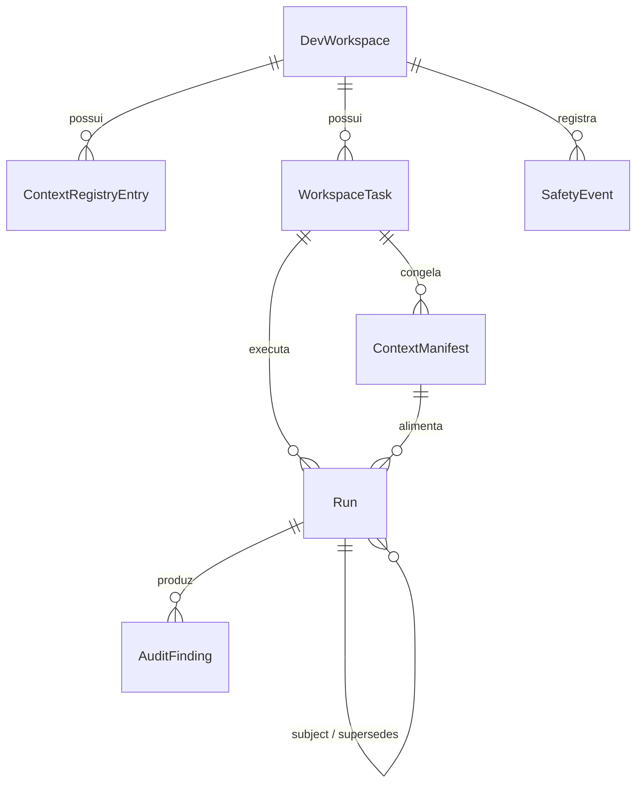
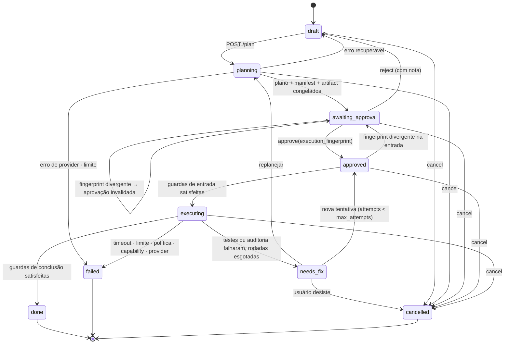

# 02 — Modelo de dados conceitual

> Escopo: entidades, invariantes, ciclo de vida, máquina de estados, fingerprint, modelo de
> `Run` e política de retenção. Decisões relacionadas:
> [ADR-0003](../adr/0003-devworkspace-independent-of-project.md),
> [ADR-0007](../adr/0007-metrics-as-typed-columns.md),
> [ADR-0008](../adr/0008-workspace-task-state-machine.md),
> [ADR-0010](../adr/0010-benchmark-protocol.md).
>
> **Revisado na Fase 1B.3** (REAUD-002, REAUD-005, REAUD-008).

## 0. Entidades da V1

**Sete tabelas.** `MetricSample` continua fora
([ADR-0007](../adr/0007-metrics-as-typed-columns.md)). O **Rendered Context Artifact** é um
blob imutável endereçado por conteúdo, referenciado pelo `ContextManifest` — não é tabela.

Todos os `id` são UUID v4 em texto — o mesmo formato de `crypto.randomUUID()` já usado no
frontend.



Convenção geral: **nenhuma operação do backend apaga arquivos do usuário.** Arquivar e
purgar afetam linhas em SQLite e, no máximo, worktrees criadas por nós dentro do nosso
`data_dir`.

---

## 1. `DevWorkspace`

| Campo | Tipo | Notas |
| --- | --- | --- |
| `id` | uuid4 str | PK |
| `name` | str | não vazio, ≤ 120 |
| `type` | enum | `personal` · `freelance` · `study` · `experiment` · `open_source` |
| `local_path` | str | absoluto, canônico, único |
| `linked_project_id` | str? | **string opaca**, nunca resolvida pelo backend |
| `repository_url` | str? | redigido se contiver credencial |
| `default_branch` | str? | base padrão; se nulo, usa o HEAD corrente |
| `status` | enum | `active` · `archived` |
| `created_at` / `updated_at` | datetime | UTC |

**Invariantes** `local_path` canonizado via `path_runtime`, existente, diretório e único;
decidido por `safety` na criação; `linked_project_id` sem FK, sem validação, sem resolução.
Não há cache de `git HEAD` — estado mutável de git é lido ao vivo e fixado apenas onde
precisa ser imutável (`ContextManifest`, `Run`).

**Ciclo de vida** `active` ⇄ `archived`. Arquivado bloqueia novas tasks; leitura liberada.

**Quem altera** apenas `workspace/`. O `orchestrator/` só lê.

**Remoção** ver §11 — **arquivar** é a operação normal; **purgar** é ação destrutiva
explícita. Não existe `DELETE` com efeito destrutivo implícito.

---

## 2. `ContextRegistryEntry`

Semântica completa em [03](03-context-architecture.md). Formato:

| Campo | Tipo | Notas |
| --- | --- | --- |
| `id` | uuid4 str | PK |
| `workspace_id` | FK | |
| `domain` | enum | `objective` · `architecture` · `stack` · `requirements` · `modules` · `decisions` · `risks` · `contracts` |
| `title` | str | não vazio |
| `body` | text | markdown; conteúdo autoral canônico |
| `structured` | json? | metadados tipados por domínio |
| `tags` | json list[str] | |
| `source_refs` | json list[str] | globs relativos ao workspace |
| `content_hash` | str | fórmula canônica única em [03](03-context-architecture.md) §2 |
| `source_hash` | str? | sobre a lista congelada `(path, blob_sha)` no commit de referência |
| `source_hash_commit` | str? | |
| `state` | enum | `fresh` · `stale` · `unknown` |
| `stale_reason` | enum? | `sources_changed` · `working_tree` |
| `origin` | enum | `manual` · `imported_planning` · `generated` |
| `last_verified_at` / `last_verified_commit` | datetime? / str? | |
| `created_at` / `updated_at` | datetime | |

**Invariantes** `body` não vazio; `content_hash` recalculado a cada escrita; `source_refs`
validados (sem `..`, sem path absoluto, sem casar com a denylist de segredos);
`stale_reason` não nulo se e somente se `state = stale`. `file_map` **não é** entrada — é
derivado.

**Exclusão** livre. O Rendered Context Artifact preserva o que foi entregue, então apagar
uma entrada **não corrompe a auditoria histórica** (§5).

---

## 3. `WorkspaceTask`

| Campo | Tipo | Notas |
| --- | --- | --- |
| `id` | uuid4 str | PK |
| `workspace_id` | FK | |
| `title` / `goal` | str / text | |
| `status` | enum | §4 |
| `phase` | enum? | `implementing` · `testing` · `auditing` — só em `executing` |
| `version` | int | concorrência otimista; toda transição é *compare-and-set* |
| `risk` / `complexity` | enum | |
| `risk_source` | enum | `hard_rule` · `llm` · `user` |
| `execution_mode` | enum | `claude_only` · `orchestrated` · `orchestrated_ruflo` |
| `benchmark_group_id` | str? | liga execuções do mesmo objetivo em modos diferentes |
| `agents` | json list[str] | ordenada |
| `plan` | json? | |
| `plan_hash` | str? | |
| `planning_base_commit` | str? | **congelado no início do planejamento** (§6) |
| `approved_manifest_id` | FK? | |
| `approved_fingerprint` | str? | §7 |
| `approved_fingerprint_parts` | json? | componentes, para diagnóstico da invalidação |
| `approved_at` | datetime? | |
| `attempts` | int | teto `max_attempts` |
| `fix_rounds` | int | teto `max_fix_rounds` — **só ativo a partir de E10** |
| `base_commit` | str? | igual a `planning_base_commit` |
| `worktree_path` | str? | diagnóstico local; **fora do contrato de provider** |
| `cancel_requested` | bool | |
| `failure_reason` | enum? | `timeout` · `limit_exceeded` · `blocked_by_policy` · `capability_unenforceable` · `provider_error` · `tests_failed` · `audit_failed` · `interrupted` · `internal_error` |
| `result_summary` | text? | curto, redigido |
| `created_at` / `started_at` / `finished_at` | datetime | |

**Invariantes**

- `phase` não nulo **se e somente se** `status = executing`.
- `failure_reason` não nulo **se e somente se** `status = failed`. Nunca em `cancelled`,
  nunca em `done`.
- `approved_at` não nulo exige `plan_hash`, `approved_manifest_id` e
  `approved_fingerprint` não nulos.
- `planning_base_commit == manifest.git_head == base_commit`, sempre (§6).
- `attempts ≤ max_attempts`; `fix_rounds ≤ max_fix_rounds`.
- Nenhuma transição ocorre fora do Execution Manager.

---

## 4. Máquina de estados

Nove estados. Detalhe em `phase` e `failure_reason`.



`needs_fix → usuário desiste` vai para **`cancelled`**, não `failed`: desistir é decisão
humana, não falha do sistema, e classificá-la como falha envenenaria a taxa de sucesso do
benchmark.

### Guardas

| Transição | Guardas obrigatórias |
| --- | --- |
| `awaiting_approval → approved` | `execution_fingerprint` recebido == recalculado; nenhuma entrada `stale` selecionada se `risk = high` |
| `approved → executing` | fingerprint **recalculado** ainda válido; slot livre; workspace é repositório git; `HEAD == planning_base_commit`; **perfil de capability provado** pelo adaptador — inclusive `execute_commands = disabled`; `attempts < max_attempts` |
| `executing → done` | testes conforme `TestPolicy`; **se o diff é não vazio em operação normal, existe auditoria vigente** (§9) para o run do Developer; nenhum `AuditFinding` `high`/`open` na auditoria vigente; verificação pós-execução aprovada |
| `needs_fix → approved` | `attempts < max_attempts` e contexto reverificado |
| qualquer → `cancelled` | estado atual não terminal |

Guardas que falham geram `409` com o motivo, e `SafetyEvent` quando a causa é política.

### Transições inválidas

`draft → executing`; `awaiting_approval → executing`; qualquer saída de `done`, `failed` ou
`cancelled` (terminais imutáveis — retomar significa **criar nova task**); `approve` com
fingerprint divergente.

### Atomicidade e idempotência

| Situação | Regra |
| --- | --- |
| **`cancel` versus conclusão** | Transição por *compare-and-set* em `(id, status, version)`. Quem commitar primeiro vence; o perdedor vira no-op. Se o cancelamento vence após o trabalho terminar, o `Run` preserva o resultado e `result_summary` registra o fato |
| **Criação de `Run`** | Idempotente por `invocation_id` (§8). Reenviar a mesma requisição reaproveita o mesmo `Run`; uma tentativa real nova gera `invocation_id` novo e `Run` novo |
| **Nova auditoria** | **Sempre um `Run` novo** (§9). Um `Run` finalizado é append-only e nunca é reaberto |
| **Recuperação de crash** | `reconcile_on_startup()` é idempotente: rodar duas vezes produz o mesmo estado. Tasks em `planning`/`executing` sem processo vivo → `failed(interrupted)`; `Run` abertos fechados como `interrupted`; worktrees preservadas |

---

## 5. `ContextManifest` e o Rendered Context Artifact

Três camadas distintas:

| Camada | Natureza | Responde |
| --- | --- | --- |
| **Context Selection** | transitória | *quais candidatos, com que pontuação* |
| **Context Manifest** | linha persistida, imutável | *quais fontes, em que commit, o que foi excluído* |
| **Rendered Context Artifact** | blob imutável endereçado por conteúdo | **o payload exato entregue** |

### `ContextManifest`

| Campo | Tipo | Notas |
| --- | --- | --- |
| `id` | uuid4 str | PK |
| `task_id` | FK | |
| `git_head` | str | == `planning_base_commit` |
| `base_branch` | str? | |
| `entries` | json | `[{entry_id, domain, title, content_hash, state, stale_reason}]` |
| `source_files` | json | lista congelada e ordenada `[{path, blob_sha}]` |
| `working_tree_divergence` | json | `{dirty_file_count, covered: [{path, kind}]}` |
| `derived` | json | `[{kind: "file_map", hash, item_count}]` |
| `excluded` | json | `[{path_or_entry, reason}]` — `budget` · `secret_policy` · `out_of_workspace` |
| `rendered_context_hash` | str | sha256 do payload final |
| `rendered_context_ref` | str | caminho no artifact store, endereçado pelo hash |
| `renderer_version` | str | |
| `approx_tokens` / `total_chars` | int | |
| `manifest_hash` | str | sha256 do conjunto normalizado |
| `created_at` | datetime | |

### Rendered Context Artifact

Arquivo JSON imutável em `data_dir/artifacts/<sha256>.json`, **endereçado por conteúdo** —
integridade verificável e deduplicação gratuita.

```text
{
  renderer_version,
  blocks: [ { order, origin, role, text, truncated, original_chars,
              emitted_chars, transformations } ],
  approx_tokens, total_chars, created_at
}
```

É um **snapshot**: sobrevive à edição e à exclusão de qualquer `ContextRegistryEntry`. A
redação de segredos é aplicada **antes** do hash. Nunca contém *chain-of-thought*,
segredo, conteúdo de `.env` ou credencial.

**GC:** um artefato só é elegível a remoção quando **nenhuma referência restante existir**
(§11).

---

## 6. Congelamento do `base_commit`

O SHA base é congelado **no início do planejamento**, antes da seleção de contexto:

```text
planning_base_commit  ==  ContextManifest.git_head  ==  Run.base_commit
```

Se o HEAD divergir no momento de executar, a execução **não usa o HEAD novo**: o fingerprint
diverge, a aprovação é invalidada e a task volta para `awaiting_approval`.

---

## 7. `execution_fingerprint` *(revisado em 1B.3 — REAUD-002)*

A versão anterior usava campos ambíguos (`provider_adapter`, `developer_model`,
`auditor_model`) e não cobria Test Runner nem política de workflow. Estrutura canônica
final:

```text
{
  "v": 1,
  "plan_hash":              <sha256>,
  "manifest_hash":          <sha256>,
  "rendered_context_hash":  <sha256>,
  "base_commit":            <sha1>,

  "developer_binding": { "adapter": …, "adapter_version": …, "model": … },
  "auditor_binding":   { "adapter": …, "adapter_version": …, "model": … } | null,
  "test_binding":      { "runner": …, "command_hash": <sha256>, "policy_hash": <sha256> },

  "agents":               [ … ],          # ordem semanticamente relevante

  "tool_profile_hash":     <sha256>,      # perfil de capability efetivo
  "safety_policy_hash":    <sha256>,      # política de segurança composta
  "workflow_policy_hash":  <sha256>,      # auditoria obrigatória, gates, rodadas

  "execution_limits": { … }               # timeouts, orçamentos, max_attempts, max_fix_rounds
}

execution_fingerprint = sha256( canonical_json( ... ) )
```

### `canonical_json` — definição conceitual

| Regra | Detalhe |
| --- | --- |
| Codificação | UTF-8, sem BOM |
| Chaves | ordenadas por code point Unicode |
| Arrays | **ordem preservada** onde é semanticamente relevante (`agents`, `argv`); listas sem semântica de ordem são ordenadas antes de serializar |
| Espaçamento | nenhum entre tokens |
| Strings | normalizadas em NFC |
| Números | inteiros sem expoente; representação decimal estável de ida e volta |
| Ausência | **explicitamente `null`** — nunca chave omitida |
| Transitórios | proibidos: timestamps, PIDs, caminhos que variam entre máquinas, contadores |
| Versão | `"v"` presente, para que uma mudança de formato não colida com fingerprints antigos |

**Auditor ausente:** se, na fase da execução, o auditor ainda não existe e a política de
workflow permite ausência, `auditor_binding` recebe **`null` explícito**. Omitir a chave
faria dois cenários distintos colidirem no mesmo hash.

**`test_binding`:** o comando **não** é string de shell no fingerprint. É normalizado como
`{executable, argv[]}`, e `command_hash = sha256(canonical_json({executable, argv}))`.
`policy_hash` cobre executáveis permitidos, `argv` configurado, `cwd`, timeout, allowlist
de ambiente, política de rede declarada e limites de saída.

Persistido em `WorkspaceTask.approved_fingerprint`, com `approved_fingerprint_parts`
guardando os componentes para que a UI diga **qual campo mudou**. Recalculado no `approve`
e novamente na guarda `approved → executing`. Nenhuma entidade nova.

---

## 8. `Run`

Um `Run` = **uma execução concreta** de um agente, provider ou runner.

| Campo | Tipo | Notas |
| --- | --- | --- |
| `id` | uuid4 str | **PK** |
| `invocation_id` | str | **UNIQUE** — chave idempotente de uma tentativa concreta |
| `task_id` | FK | |
| `subject_run_id` | FK? | **o `Run` avaliado**, para `workflow_audit` e `benchmark_evaluation` |
| `supersedes_run_id` | FK? | auditoria anterior que esta pretende substituir |
| `context_manifest_id` | FK? | nulo quando o run não recebe contexto |
| `agent` | enum | `orchestrator` · `developer` · `auditor` · `architect` · `researcher` · `test_runner` |
| `purpose` | enum | `execution` · `workflow_audit` · `benchmark_evaluation` |
| `attempt_index` / `fix_round` | int | posição no ciclo (informativo, **não** chave) |
| `provider` / `model` | str / str? | |
| `provider_adapter` / `adapter_version` | str / str? | |
| `transport` | enum | `cli` · `api` · `process` |
| `tool_profile_hash` | str? | perfil efetivo do run |
| `status` | enum | `ok` · `error` · `timeout` · `cancelled` · `blocked` · `interrupted` |
| `started_at` / `finished_at` / `duration_ms` | | |
| `input_tokens` / `output_tokens` | int? | nulos quando indisponíveis |
| `token_source` | enum | `reported` · `estimated` · `unavailable` |
| `files_read` | json? | **nullable** — §10 |
| `files_read_source` | enum | `reported` · `inferred` · `unavailable` |
| `files_changed` | json | **sempre derivado pelo Git Runtime** |
| `diff_added` / `diff_removed` | int | **sempre derivados pelo Git Runtime** |
| `test_summary` | json? | `{framework, exit_code, passed, failed, skipped, duration_ms}` |
| `worktree_path` | str? | diagnóstico local |
| `base_commit` | str? | |
| `prompt_sha256` | str? | impressão digital, **não o prompt** |
| `summary` / `error_summary` | text? | curtos, redigidos |
| `log_ref` | str? | log completo já redigido |

### Chaves e idempotência *(revisado em 1B.3 — REAUD-005)*

> **Constraint anterior removida.** `(task_id, agent, attempt_index, fix_round, purpose)`
> impedia **duas auditorias legítimas** sobre o mesmo `Run` — exatamente o caso da
> reauditoria. Foi substituída.

| Chave | Papel |
| --- | --- |
| `Run.id` | **PK** |
| `Run.invocation_id` | **UNIQUE** — identifica **uma tentativa concreta** |

Regra de idempotência: se a mesma requisição HTTP ou o mesmo processamento for reenviado
com o **mesmo `invocation_id`**, o `Run` existente é reaproveitado e devolvido. Uma
tentativa real nova gera **`invocation_id` novo** e, portanto, **`Run` novo**.

`attempt_index` e `fix_round` permanecem como metadados informativos e de ordenação — não
são chave e não restringem nada.

**O que nunca é persistido** raciocínio privado / *chain-of-thought* / blocos de
*thinking*; corpo do prompt; trechos marcados pelo redator; `argv` completo e ambiente do
processo filho.

**Invariantes** append-only após `finished_at`; `duration_ms` coerente; `subject_run_id`
não nulo quando `purpose ∈ {workflow_audit, benchmark_evaluation}`.

**Quem altera** apenas o Execution Manager. `agent_runtime/` devolve resultado e não toca
o banco.

---

## 9. Modelo de auditoria *(revisado em 1B.3 — REAUD-005)*

> **Correção.** A versão anterior dizia que reauditar "substitui atomicamente os findings
> daquele run". Isso conflitava com o `Run` ser append-only e com a constraint de
> unicidade. O modelo passa a ser **encadeado**, não sobrescrito.

```text
DeveloperRun X                                  (purpose = execution)
  ↑ subject_run_id
AuditRun A   supersedes_run_id = null           (purpose = workflow_audit)
  ↑ supersedes_run_id
AuditRun B   subject_run_id = X                 (reauditoria)
```

Regras:

1. **Cada auditoria é um `Run` novo.** Um `Run` finalizado nunca é reaberto nem reutilizado.
2. `AuditFinding.run_id` aponta **sempre para o `Run` do auditor**. O sujeito é resolvido
   por `AuditFinding.run_id → Run.subject_run_id`.
3. Reauditoria opcionalmente encadeia por `supersedes_run_id`, sem entidade nova. A
   referência só pode apontar para um run anterior com o **mesmo `subject_run_id` e o
   mesmo `purpose`**; não pode apontar para si nem formar ciclo.
4. Uma auditoria só supera a anterior quando termina com `status = ok`. Falha, timeout ou
   cancelamento da reauditoria preservam a auditoria vigente anterior.
5. **Auditoria vigente** de um sujeito = o **`Run` de auditoria bem-sucedido mais recente
   que não tenha sido superado por outro run bem-sucedido**. Empates são resolvidos por
   `(finished_at, id)`. A criação/finalização usa *compare-and-set* sobre a auditoria
   vigente, impedindo duas reauditorias concorrentes de se declararem sucessoras da mesma
   versão. Só a vigente conta para a guarda `executing → done`.
6. Findings de auditorias superadas permanecem como histórico e não bloqueiam nada.

### `AuditFinding`

| Campo | Tipo | Notas |
| --- | --- | --- |
| `id` | uuid4 str | PK |
| `run_id` | FK | **o `Run` do auditor** |
| `purpose` | enum | `workflow_audit` · `benchmark_evaluation` |
| `rubric_version` | str? | obrigatório em `benchmark_evaluation` |
| `severity` | enum | `info` · `low` · `medium` · `high` |
| `category` | str | slug curto |
| `file` / `line` | str? / int? | relativo ao workspace |
| `summary` / `detail` | text / text? | |
| `status` | enum | `open` · `accepted` · `dismissed` · `fixed` |
| `created_at` | datetime | |

Somente `workflow_audit` com `severity = high` e `status = open`, **na auditoria vigente**,
bloqueia `done`. Nenhum finding de `benchmark_evaluation` altera resultado de execução
([ADR-0010](../adr/0010-benchmark-protocol.md)).

---

## 10. Proveniência de métricas

| Métrica | Fonte | Regra |
| --- | --- | --- |
| `files_read` | `ToolExecutor` (mediado) | **Nullable.** `[]` = *medido, nada foi lido*. Indisponível = **`null`** com `files_read_source = unavailable`. **Nunca `[]` para ausência** |
| `files_read_source` | — | `reported` (ToolExecutor mediado ou API contratual) · `inferred` · `unavailable` |
| `files_changed` | **Git Runtime, sempre** | Derivado do diff contra `base_commit`. Nunca vem do provider |
| `diff_added` / `diff_removed` | **Git Runtime, sempre** | Idem |
| `input_tokens` / `output_tokens` | provider | Nullable + `token_source` |
| `test_summary` | Test Runner | Código de saída e relatório do framework |

Com `read_files = mediated` obrigatório e `execute_commands = disabled`, **toda leitura do
Developer é mediada**: `files_read_source = reported` passa a ser a regra, não a exceção.
Não há campo genérico `usage_quality`.

---

## 11. Arquivar, purgar e retenção *(novo em 1B.3 — REAUD-008)*

> **Correção.** `DELETE …?hard=true` colocava uma ação destrutiva a um parâmetro de
> distância de uma operação rotineira. Foi substituído por duas operações com nomes e
> riscos distintos.

| Operação | Natureza | Efeito |
| --- | --- | --- |
| **`archive`** | normal e **reversível** | Marca `status = archived`. Bloqueia novas tasks. **Preserva histórico integral**: contexto, tasks, runs, findings, manifests, artefatos |
| **`purge`** | **destrutiva e explícita** | Remove os dados purgáveis relacionados. Não tem desfazer |

### Regras de `purge`

1. Workspace só pode ser purgado quando está **arquivado e sem task não terminal**. Task
   só pode ser purgada em `done`, `failed` ou `cancelled`.
2. **Preview obrigatório antes.** A prévia devolve as contagens do que será removido:

   ```text
   { workspaces, tasks, runs, findings, manifests, artifacts }
   ```

3. Exige **confirmação forte** — `confirm_phrase` ou token de purga de curta duração. A
   forma exata **não é implementada nesta fase**; o contrato registra que a confirmação é
   obrigatória e não pode ser um simples parâmetro de query.
4. **`SafetyEvent` não é apagado** por purga normal. É trilha de auditoria e tem retenção
   própria, mais longa, sem cascade silencioso.
5. **Rendered artifacts** só entram em GC quando **nenhuma referência restante existir** —
   o endereçamento por conteúdo faz manifests distintos compartilharem o mesmo arquivo.
6. **Dados de benchmark são protegidos.** Se a task ou o workspace pertence a um
   `benchmark_group_id` que já possui findings de `benchmark_evaluation`, a prévia sinaliza
   e a purga é **recusada**. Métricas de comparação não podem desaparecer por exclusão
   acidental.
7. O repositório do usuário **nunca** é tocado. No máximo, worktrees nossas sob `data_dir`.

### Retenção

| Dado | Retenção |
| --- | --- |
| Linhas de domínio (workspace, task, run, finding, manifest) | indefinida; removidas só por purga explícita |
| `SafetyEvent` | separada e mais longa; **nunca** cascateada |
| Rendered artifacts | enquanto referenciados |
| `log_ref` (logs de run) | 30 dias por padrão, configurável |
| Worktrees | preservadas em falha; GC por idade (14 dias) só em tasks terminais |

Nada de sistema complexo de *compliance*: as regras acima são a política inteira.

---

## 12. `SafetyEvent`

Trilha append-only. Nunca atualizada, nunca apagada, não cascateada.

| Campo | Tipo | Notas |
| --- | --- | --- |
| `id` | uuid4 str | PK |
| `workspace_id` / `task_id` / `run_id` | str? | sem FK forte — sobrevivem à purga |
| `kind` | enum | `path_denied` · `command_denied` · `secret_access_blocked` · `capability_unenforceable` · `capability_denied` · `limit_exceeded` · `approval_granted` · `approval_invalidated` · `retry_limit` · `timeout` · `cancelled` · `out_of_worktree_write` · `toctou_recheck_failed` · `purge_executed` |
| `decision` | enum | `allow` · `deny` |
| `rule_id` | str | identificador estável da regra |
| `subject` | str | path ou rótulo de operação, **já redigido** |
| `detail` | text? | redigido |
| `created_at` | datetime | |

Registram-se todos os `deny` e os `allow` relevantes para auditoria — aprovação concedida,
aprovação invalidada, purga executada. Não se registra cada leitura permitida.

---

## 13. Por que não existe `MetricSample`

Todas as métricas exigidas são **fatos de esquema fixo, um por `Run` ou por
`WorkspaceTask`**. Uma tabela chave/valor genérica custaria perda de tipagem, um `JOIN` e
um `GROUP BY` a mais em toda consulta, e o fim dos invariantes verificáveis pelo banco.

A dimensão do benchmark é `execution_mode`, agrupada por `benchmark_group_id`; a comparação
é agregação sobre `Run ⋈ WorkspaceTask` filtrando `Run.purpose`. `MetricSample` volta à
mesa apenas se aparecer métrica **esparsa e irregular**, com chave desconhecida em tempo de
projeto.
