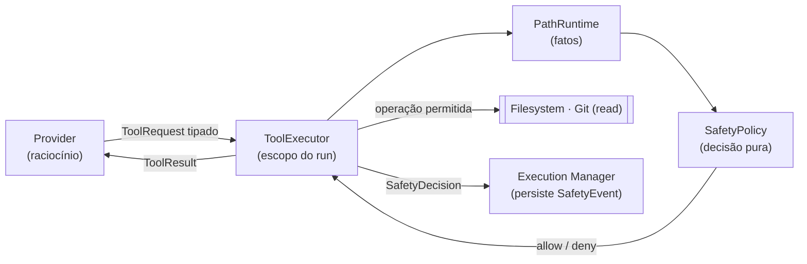
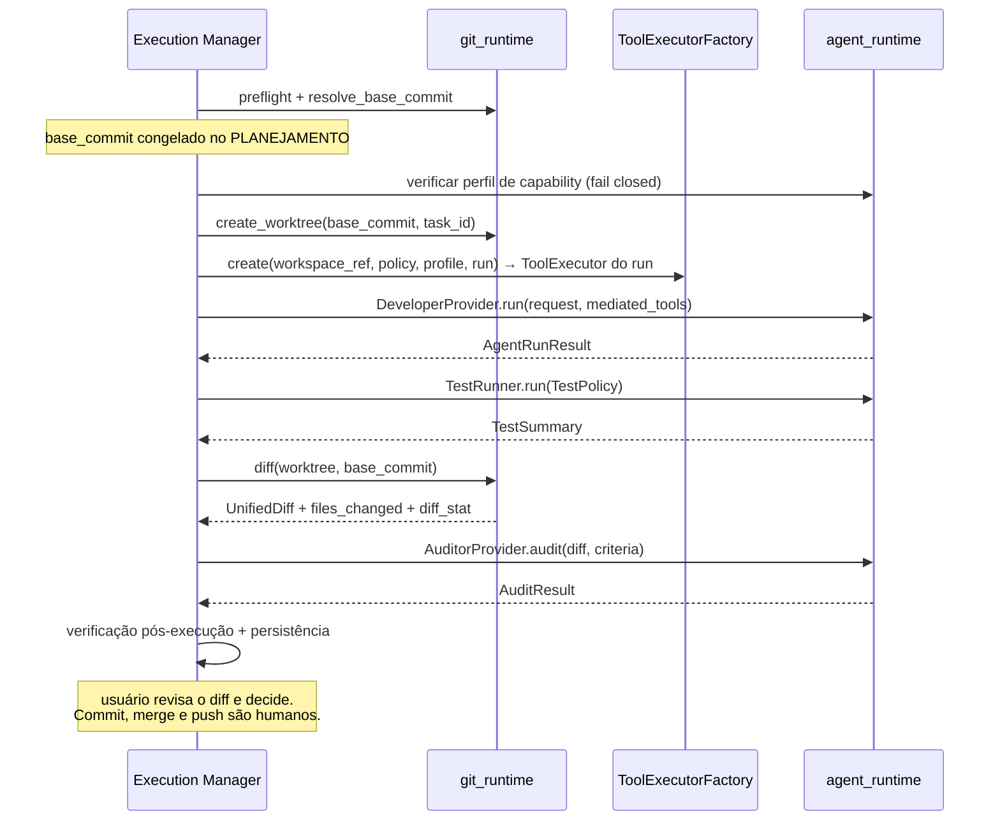

# 04 — Segurança e Git runtime

> Escopo: capabilities de provider, execução mediada, política pura, `PathRuntime`,
> política de testes e protocolo de worktree.
> Decisões relacionadas: [ADR-0004](../adr/0004-safety-before-agents.md),
> [ADR-0009](../adr/0009-provider-capability-enforcement.md).
>
> **Revisado na Fase 1B.3** (REAUD-001 P0, REAUD-004, REAUD-006).
>
> **Este é o documento mais crítico da V1.**

---

## 0. O que a V1 garante e o que não garante

Declaração honesta, antes de tudo, porque condiciona o resto:

> **Não existe, na V1, uma fronteira de execução confiável e completa.**
> `trusted execution boundary = ausente`.
>
> A mediação de ferramentas protege a **autoridade do provider**. Ela **não** transforma o
> código do projeto — executado pelo Test Runner — em código confinado. Sem isolamento de
> sistema operacional, `npm test` e `pytest` continuam podendo fazer tudo o que o usuário
> pode fazer.

Nada neste documento deve ser lido como *sandbox*. Onde a palavra aparece, é para negá-la.

---

## 1. Capabilities de provider *(REAUD-001, P0)*

### O problema que restava

A Fase 1B.1 introduziu a mediação, mas admitia `execute_commands = mediated` para o
Developer. A reauditoria mostrou que isso é um **trampolim**: mediar
`python -c "..."`, `node -e "..."`, `npm run <script>` ou qualquer script do projeto
valida o **argv**, e argv nenhum descreve o que o processo fará depois. A autoridade
escapa por transitividade e a mediação vira teatro.

### Decisão oficial da V1

> **`DeveloperProvider.execute_commands = disabled`. Sem exceção.**

O Developer **não possui**: shell, terminal, exec arbitrário, `python -c`, `node -e`,
`npm`, `pytest`, scripts do projeto ou `subprocess` de qualquer natureza. Ele trabalha
exclusivamente por operações mediadas e tipadas.

### Perfis oficiais

| Capability | **Developer** | **Auditor** |
| --- | --- | --- |
| `read_files` | `mediated` | `disabled` |
| `write_files` | `mediated` | `disabled` |
| `execute_commands` | **`disabled`** | `disabled` |
| `git_read` | `fixed_operations_only` | `disabled` |
| `git_write` | `disabled` | `disabled` |
| `network` | `disabled` | `disabled` |
| `external_paths` | `disabled` | `disabled` |

O **Auditor é uma função pura sobre o payload**: recebe diff, critérios de aceite e resumo
de testes no próprio request, e não precisa de nenhum acesso ao filesystem. Um auditor sem
capability alguma é mais fácil de confiar e mais barato de operar.

### Modos de enforcement

| Modo | Significado |
| --- | --- |
| `disabled` | desligada no provider; ele não tem a ferramenta |
| `mediated` | só alcançável através do `ToolExecutor`, com payload tipado |
| **`fixed_operations_only`** | *(novo em 1B.3)* apenas operações nomeadas, com **argv formado pelo runtime**; o provider nomeia a operação e passa parâmetros tipados, nunca uma linha de comando |
| `unmediated` | provider age sozinho, sem verificação — **nunca aceito na V1** |

### O que cada adaptador declara — e prova

| Campo | Significado |
| --- | --- |
| `supported_capabilities` | o que o provider **tecnicamente consegue** fazer |
| `effective_capabilities` | o que ficará **realmente permitido** nesta execução |
| `enforcement_method` | `cli_flag` · `config_file` · `tool_allowlist` · `api_tool_schema` · `process_env` · `not_enforceable` |
| `enforcement_evidence` | flags e configuração concretamente aplicadas; sonda de preflight onde viável |

**Declaração não é prova.** Onde o adaptador só consegue declarar, a capability não é
concedida.

### Fail closed

```text
requisitado:  execute_commands = disabled
adaptador:    não consegue desligar a ferramenta de shell
→ execução RECUSADA antes de subir qualquer processo
→ SafetyEvent(capability_unenforceable)
→ task → failed(failure_reason = capability_unenforceable)
```

Nenhuma suposição de que Claude CLI, Codex CLI ou APIs tenham os mesmos controles. Cada
adaptador prova a própria capacidade, e o contrato funciona igual para CLI hoje e API
amanhã.

`tool_profile_hash` entra no `execution_fingerprint` ([02](02-data-model.md) §7): mudar o
perfil invalida a aprovação.

### Reabertura futura

Permitir shell, `python`, `node`, `npm` ou comandos arbitrários ao Developer **exige
reabrir a decisão de segurança**. Gatilho: isolamento de processo/SO comprovadamente
forte — contêiner, VM, *job object*/isolamento do Windows mais forte, ou outro mecanismo
demonstrado. **Fora da V1.**

---

## 2. `ToolExecutor` — o conjunto fechado de operações



### Operações disponíveis ao Developer — lista fechada

| Operação | Capability | Notas |
| --- | --- | --- |
| `ReadFile` | `read_files` | caminho relativo ao workspace |
| `ListDirectory` | `read_files` | |
| `SearchText` | `read_files` | busca implementada pelo runtime, não por `grep` externo |
| `WriteFile` | `write_files` | conteúdo integral |
| `ApplyPatch` | `write_files` | diff unificado aplicado pelo runtime |
| `GitStatus` | `git_read` | argv formado pelo runtime |
| `GitDiff` | `git_read` | idem |
| `GitShow` | `git_read` | idem |
| `GitListTree` | `git_read` | idem |

**Não existe `ExecCommand` genérico exposto ao Developer na V1.** Leitura de git é
representada por **operações específicas**, não por shell genérico: o provider nomeia
`GitDiff` com parâmetros tipados, e é o runtime que monta o `argv`. O provider nunca
fornece uma linha de comando crua.

### Regras

- Toda negação produz `SafetyDecision` → `SafetyEvent`, e volta ao provider como negação
  explícita. Não há caminho alternativo.
- O executor é **criado por run** por uma `ToolExecutorFactory` (§3), vinculado a um
  `ExecutionWorkspaceRef`, a uma `SafetyPolicy` composta e a um perfil de capability
  efetivo.
- A medição do `ToolExecutor` é a fonte autoritativa de `files_read`
  ([02](02-data-model.md) §10). Como **toda** leitura do Developer é mediada,
  `files_read_source = reported` passa a ser a regra, não a exceção.

---

## 3. Ciclo de vida — `ToolExecutorFactory` *(REAUD-006)*

| Escopo | Objeto |
| --- | --- |
| **Vida da aplicação** | `ToolExecutorFactory`, construída no composition root |
| **Vida do run** | `ToolExecutor`, criado pela factory para aquele run |

O composition root **não cria um `ToolExecutor` global** — não haveria como: o executor
depende de `ExecutionWorkspaceRef`, política composta, perfil de capability efetivo e
metadados de task/run, que só existem em tempo de execução.

```text
startup            → injeta ToolExecutorFactory no Execution Manager
início de um run   → tool_executor = factory.create(workspace_ref, policy,
                                                    capability_profile, task/run metadata)
                   → provider recebe as ferramentas mediadas com escopo daquele run
fim do run         → executor descartado; medições consolidadas no Run
```

Um executor nunca atravessa runs. Isso torna impossível que um run herde autoridade,
`ExecutionWorkspaceRef` ou contagem de outro.

---

## 4. Política pura e `PathRuntime` *(REAUD-004)*

### A contradição corrigida

`safety/` era declarado puro, mas a validação de path exige IO real: canonicalizar, seguir
symlinks, inspecionar reparse points, abrir handles e comparar identidade de objeto. Os
dois papéis foram separados.

| Componente | Natureza | Faz |
| --- | --- | --- |
| **`safety/`** | **pura** — zero IO | recebe fatos, decide |
| **`path_runtime.py`** | infraestrutura | faz o IO e **produz os fatos** |

### `PathFacts`

Estrutura pura (definida em `safety/`, preenchida por `path_runtime`):

```text
PathFacts {
  requested_path
  canonical_root
  canonical_target
  exists
  parent_identity
  target_identity?          # device+inode | volume serial + file index
  volume
  is_symlink
  is_junction
  is_reparse_point
  is_unc
  is_device_namespace
  is_drive_relative
  contained                 # canonical_target está sob canonical_root
  post_open_target?         # preenchido apenas na fase pós-abertura
}
```

### Fluxo

```text
1. safety.prevalidate_path_syntax(requested)     # puro: string; rejeita ".." , "~",
                                                 # UNC, device namespace, drive-relative,
                                                 # ADS, componentes com ponto/espaço final,
                                                 # nomes reservados, aliases 8.3
2. path_runtime.inspect(requested, root)  → PathFacts        # IO
3. safety.decide_path(facts)              → SafetyDecision   # puro
4. abrir o handle                                            # SEM truncar
5. path_runtime.inspect_opened(handle)    → PathFacts        # IO, com post_open_target
6. safety.decide_post_open(facts)         → SafetyDecision   # puro
7. executar a operação                                       # só aqui trunca/escreve
```

**Regra de ordem, obrigatória:** escrita ou truncamento **nunca** ocorrem antes da
validação pós-abertura, onde tecnicamente possível. Abrir com modo truncante antes do
passo 6 destruiria o arquivo mesmo quando a decisão fosse negar.

`path_runtime` não importa `db`, `orchestrator`, `agent_runtime`, `tool_executor` nem
`api`; e `safety/` **não importa `path_runtime`** — a dependência é só na direção
`path_runtime → safety` (para os tipos).

### Windows — o que a inspeção precisa cobrir

UNC (`\\servidor\share`, `\\?\UNC\…`), device namespace (`\\?\`, `\\.\`), nomes reservados
(`CON`, `PRN`, `AUX`, `NUL`, `COM1`–`COM9`, `LPT1`–`LPT9`), drive-relative (`C:arquivo`),
root-relative (`\arquivo`), alternate data streams (`arquivo.txt:fluxo`), componentes com
ponto ou espaço final, aliases 8.3 (`PROGRA~1`), normalização de drive e caixa, junctions
e reparse points em **todos** os ancestrais entre `root` e o alvo.

Nesta máquina o repositório está em
`C:\Users\pedro\OneDrive\Desktop\freelance-focus-dashboard`: worktrees ficam em
`%LOCALAPPDATA%` com nomes curtos (`ff-task-<id8>`) por causa do limite de 260 caracteres —
**mitigação parcial**, ver §7.

### Risco residual declarado

> Entre a inspeção (passo 2) e a abertura (passo 4), um componente do caminho pode ser
> trocado. A validação pós-abertura **estreita** a janela; não a fecha. Fechá-la exigiria
> primitivas de resolução atômica — `openat2(RESOLVE_BENEATH)` no Linux, sem equivalente
> portável no Windows — que a biblioteca padrão do Python não expõe de forma uniforme.
> **A V1 aceita este risco TOCTOU residual e o declara.**

---

## 5. As três peças de política

| Peça | Natureza | Onde vive |
| --- | --- | --- |
| `SafetyPolicy` | configuração imutável: allowlists, denylists, limites, globs de segredo, perfis de capability, `TestPolicy` | `safety/` |
| `SafetyDecision` | resultado puro: `{allow, rule_id, reason, subject_redacted}` | `safety/` |
| `SafetyEvent` | registro persistido de decisão relevante | tabela, escrita pelo Execution Manager |

**Composição:** política global mais override opcional por workspace. **Um override só
restringe, nunca afrouxa** — a composição é intersecção de permissões.
`safety_policy_hash` cobre a política composta efetiva e entra no fingerprint.

### A regra inegociável

```text
Nenhum LLM participa de uma SafetyDecision.
```

O gate é chamado pelo `ToolExecutor` e pelo Execution Manager — nunca pelo agente. Texto
dentro de um repositório (README, comentário, issue, configuração) é **dado, nunca
instrução**: nada ali eleva permissão.

### Proteção de segredos — três camadas

| Camada | Onde age | O que faz |
| --- | --- | --- |
| **1 — Seleção** | `context_engine` | Glob que casaria com arquivo secreto é rejeitado na escrita da entrada; no manifest, secretos entram em `excluded` com `reason = secret_policy` |
| **2 — Acesso** | `safety` + `path_runtime` + `ToolExecutor` | Nega leitura e escrita de path da denylist, para qualquer operação mediada |
| **3 — Saída** | `safety.redact` | Texto que sai do backend — resposta JSON, log, `summary`, `error_summary`, diff — passa pelo redator |

**Denylist inicial** `.env*`, `*.pem`, `*.key`, `*.p12`, `*.pfx`, `id_rsa*`, `id_ed25519*`,
`.npmrc`, `.pypirc`, `.git-credentials`, `.aws/**`, `.ssh/**`, `secrets/**`,
`**/credentials*`, `**/*secret*`.

**Ambiente dos filhos é allowlist.** A chave de um provider vai **somente** para o processo
daquele provider — nunca para o Test Runner, nunca para o git.

> **Limite da camada 2:** cobre operações **mediadas**. Com `execute_commands = disabled`
> o Developer não tem como escapar dela. O Test Runner (§6) é outra história.

---

## 6. Test Runner — separado do Developer *(REAUD-001, §3)*

**Testes não são ferramentas do Developer.** O Developer não pode invocá-los, nem direta
nem indiretamente.

```text
Developer conclui as mudanças (só WriteFile / ApplyPatch)
  → Execution Manager
  → Test Runner            ← infraestrutura controlada pelo sistema
  → resultados estruturados
  → próximo estado da task
```

O Test Runner executa `pytest`, `npm test`, lint ou build **somente segundo a `TestPolicy`
configurada pelo sistema** — nunca segundo algo que o provider tenha pedido.

### `TestPolicy`

| Item | Definição |
| --- | --- |
| Executáveis permitidos | allowlist explícita |
| `argv` | configurado/normalizado; nunca string de shell livre |
| `cwd` | a worktree da task |
| `timeout` | por execução |
| Ambiente | allowlist, sem chaves de provider |
| Política de rede | **declarada** (não imposta tecnicamente na V1) |
| Limites de saída | tamanho máximo capturado |

`policy_hash` e `command_hash` derivados dessa configuração entram no `test_binding` do
`execution_fingerprint` ([02](02-data-model.md) §7).

### Declaração explícita

> A mediação de ferramentas protege a autoridade do **provider**. Ela **não** transforma o
> código do projeto executado pelo Test Runner em código confinado.
>
> Executar testes executa código do projeto, que pode ler qualquer arquivo do usuário,
> abrir rede e escrever fora da worktree. **Sem isolamento de SO, isso permanece risco
> residual aceito.** Não é sandbox, e não deve ser chamado assim.

O que a V1 oferece aqui: `cwd` na worktree, ambiente por allowlist, allowlist do **ponto de
entrada**, timeout, terminação de árvore de processos e verificação pós-execução da árvore
principal. O que **não** oferece: impedir que um script de teste comprometido escreva em
`%USERPROFILE%`, leia `~/.ssh` ou abra rede.

---

## 7. Limites, aprovação, verificação e OneDrive

### Limites

| Limite | Ação ao estourar |
| --- | --- |
| `run_timeout_s` | mata a árvore de processos → `Run.timeout` → `failed(timeout)` |
| `task_timeout_s` | idem, no nível da task |
| `max_context_tokens` / `max_total_tokens` | `SafetyEvent(limit_exceeded)` → `failed(limit_exceeded)` |
| `max_attempts` / `max_fix_rounds` | `SafetyEvent(retry_limit)` → `failed` |
| `max_parallel_agents = 1` | tasks aprovadas esperam em fila |

**Terminação de árvore de processos** — sinal cooperativo → período de graça → terminação
da árvore inteira (Windows: enumeração recursiva; POSIX: grupo de processos) → confirmação
de que nenhum descendente sobreviveu. Aplica-se ao Test Runner e ao processo do provider.

### Aprovação vinculada

`approve` exige o `execution_fingerprint` completo ([02](02-data-model.md) §7). Qualquer
campo coberto que mude — plano, manifest, payload renderizado, base commit, binding do
Developer, do Auditor ou do Test Runner, agentes, perfil de capability, hash de política de
segurança, hash de política de workflow, limites — invalida a aprovação: `409`,
`SafetyEvent(approval_invalidated)`, volta a `awaiting_approval` indicando **qual campo**
mudou.

### Verificação pós-execução

1. `git status --porcelain=v2` na **árvore principal**, comparado ao snapshot anterior ao
   run. Diferença → `SafetyEvent(out_of_worktree_write)`, run `blocked`, task para.
2. Arquivos alterados na worktree reconferidos contra a política de path.
3. O diff passa pelo redator antes de ser exposto.

**Alcance real:** detecta escrita na árvore principal. **Não** detecta escrita em outros
lugares do disco. É detecção pontual, não contenção.

### OneDrive — mitigação parcial

Worktrees fora do OneDrive **reduzem**, mas **não eliminam** o risco: os metadados da
worktree vinculada (`.git/worktrees/<nome>/` com `gitdir`, `HEAD` e índice), refs, objetos
e `.git/index` vivem no `.git` do **repositório principal**, dentro do OneDrive, e seguem
sujeitos a lock e sincronização concorrente.

**Risco residual aceito, com recuperação documentada:** `git worktree list` →
`git worktree prune` → `git worktree repair` → em último caso, remoção do diretório de
metadados obsoleto em `.git/worktrees/<nome>/`.

**Alternativas futuras, em ordem de simplicidade** — nenhuma implementada:
**(1)** mover o repositório para fora do OneDrive; **(2)** clone/cache operacional fora do
OneDrive; **(3)** repositório operacional *bare*/mirror.

---

## 8. Protocolo do Git runtime

O `git_runtime` executa git com `argv` formado pelo runtime, `shell=False` e `cwd` fixado.
Ele é infraestrutura do sistema — **não** é uma ferramenta do provider. O Developer só
alcança git por `GitStatus`/`GitDiff`/`GitShow`/`GitListTree`, que o `ToolExecutor`
traduz.

**Nunca executa** `commit`, `merge`, `push`, `pull`, `fetch`, `rebase`, `reset --hard`,
`clean -fdx`, `filter-branch`, `remote set-url`, `config --global`. Commit, merge e push
permanecem humanos na V1.



Convenções: worktree em `<data_dir>/worktrees/ff-task-<id8>`, branch `ff/task-<id8>`,
criada a partir do **SHA congelado no planejamento** — nunca de um nome de branch.

### Comportamento em cada situação

| Situação | Comportamento |
| --- | --- |
| **Não é repositório git** | Workspace utilizável para **contexto**; execução bloqueada com motivo. O backend **não** roda `git init` |
| **Árvore principal suja** | Não impede. A worktree nasce do `base_commit` e não enxerga o não commitado. Divergência registrada no manifest e mostrada antes da aprovação |
| **HEAD mudou desde o planejamento** | Fingerprint diverge → aprovação invalidada → replanejar. A execução **nunca** salta para o HEAD novo |
| **`default_branch` inexistente** | Usa o HEAD corrente e registra `base_commit` |
| **Worktree já existe para a task** | Reutilizada se pertence à mesma task e está limpa; caso contrário recusa |
| **Cancelamento / falha** | Árvore de processos morta; worktree **preservada** para diagnóstico |
| **Crash do backend** | `reconcile_on_startup()` cruza `git worktree list` com as tasks; idempotente |
| **Cleanup** | Nunca automático em falha. Em `done`, `POST /api/tasks/{id}/worktree/discard`. GC por idade (14 dias) só em tasks terminais, sempre via `git worktree remove` + `prune` |

O `git_runtime` nunca escreve no banco: devolve fatos, e o Execution Manager persiste. É a
**fonte autoritativa** de `files_changed` e `diff_stat` ([02](02-data-model.md) §10).
