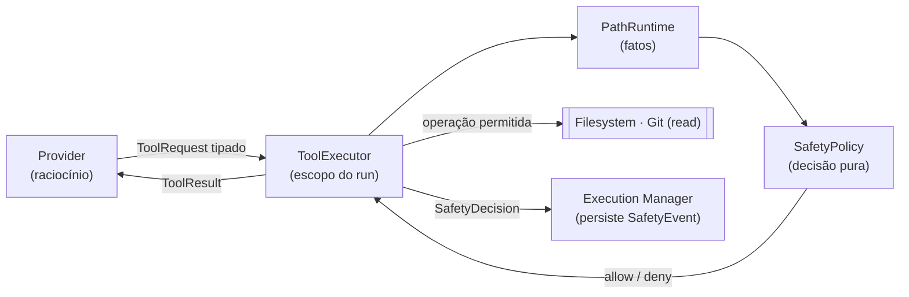
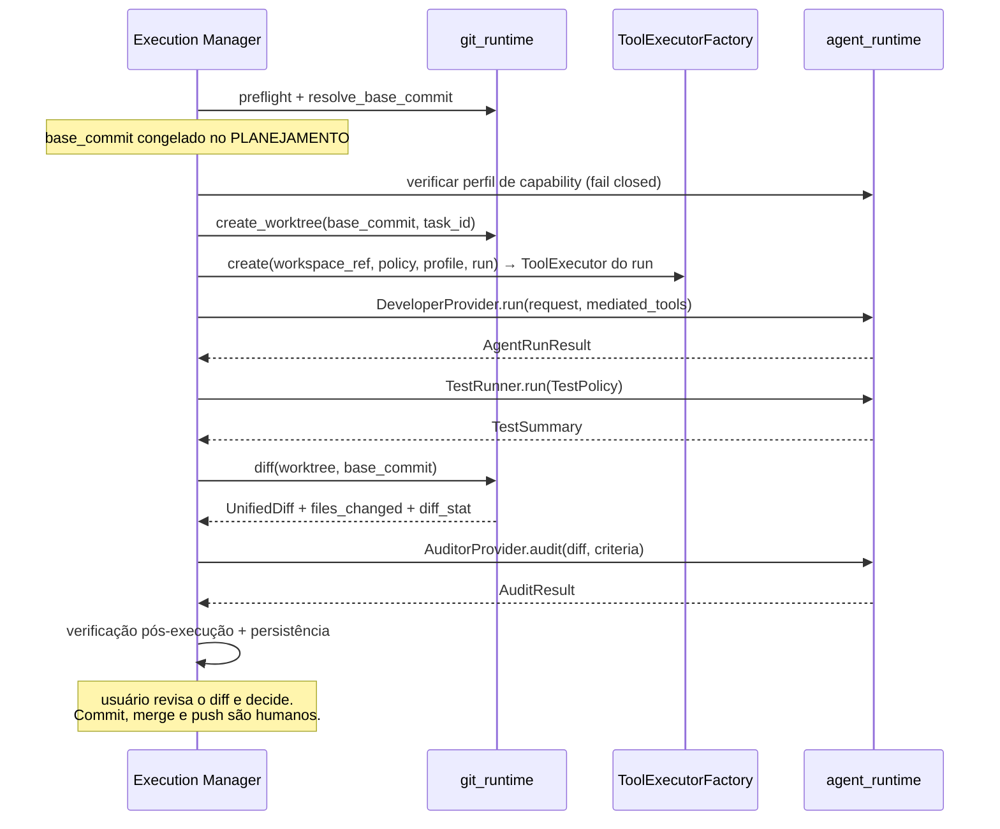

# 04 — Segurança e Git runtime

> Escopo: capabilities de provider, execução mediada, política pura, `PathRuntime`,
> política de testes e protocolo de worktree.
> Decisões relacionadas: [ADR-0004](../adr/0004-safety-before-agents.md),
> [ADR-0009](../adr/0009-provider-capability-enforcement.md).
>
> **Revisado na Fase 1B.3** (REAUD-001 P0, REAUD-004, REAUD-006).
>
> **Esclarecido após a E6 Rodada 7** — §5 apenas: precisão da âncora (E6-AUD7-003), risco
> residual de *over-redaction* aceito (E6-AUD7-004), as duas classes de escape da fronteira
> JSON, e as duas garantias que a implementação ainda deve (E6-AUD7-001, E6-AUD7-002).
> Nenhuma decisão anterior foi reescrita: a afirmação superada está marcada no lugar.
>
> **Este é o documento mais crítico da V1.**

---

## 0. O que a V1 garante e o que não garante

Declaração honesta, antes de tudo, porque condiciona o resto:

> **Não existe, na V1, uma fronteira de execução confiável e completa.**
> `trusted execution boundary = ausente`.
>
> A mediação de ferramentas protege a **autoridade do provider**. Ela **não** transforma o
> código do projeto — executado pelo Test Runner — em código confinado. Sem isolamento de
> sistema operacional, `npm test` e `pytest` continuam podendo fazer tudo o que o usuário
> pode fazer.

Nada neste documento deve ser lido como *sandbox*. Onde a palavra aparece, é para negá-la.

---

## 1. Capabilities de provider *(REAUD-001, P0)*

### O problema que restava

A Fase 1B.1 introduziu a mediação, mas admitia `execute_commands = mediated` para o
Developer. A reauditoria mostrou que isso é um **trampolim**: mediar
`python -c "..."`, `node -e "..."`, `npm run <script>` ou qualquer script do projeto
valida o **argv**, e argv nenhum descreve o que o processo fará depois. A autoridade
escapa por transitividade e a mediação vira teatro.

### Decisão oficial da V1

> **`DeveloperProvider.execute_commands = disabled`. Sem exceção.**

O Developer **não possui**: shell, terminal, exec arbitrário, `python -c`, `node -e`,
`npm`, `pytest`, scripts do projeto ou `subprocess` de qualquer natureza. Ele trabalha
exclusivamente por operações mediadas e tipadas.

### Perfis oficiais

| Capability | **Developer** | **Auditor** |
| --- | --- | --- |
| `read_files` | `mediated` | `disabled` |
| `write_files` | `mediated` | `disabled` |
| `execute_commands` | **`disabled`** | `disabled` |
| `git_read` | `fixed_operations_only` | `disabled` |
| `git_write` | `disabled` | `disabled` |
| `network` | `disabled` | `disabled` |
| `external_paths` | `disabled` | `disabled` |

O **Auditor é uma função pura sobre o payload**: recebe diff, critérios de aceite e resumo
de testes no próprio request, e não precisa de nenhum acesso ao filesystem. Um auditor sem
capability alguma é mais fácil de confiar e mais barato de operar.

### Modos de enforcement

| Modo | Significado |
| --- | --- |
| `disabled` | desligada no provider; ele não tem a ferramenta |
| `mediated` | só alcançável através do `ToolExecutor`, com payload tipado |
| **`fixed_operations_only`** | *(novo em 1B.3)* apenas operações nomeadas, com **argv formado pelo runtime**; o provider nomeia a operação e passa parâmetros tipados, nunca uma linha de comando |
| `unmediated` | provider age sozinho, sem verificação — **nunca aceito na V1** |

### O que cada adaptador declara — e prova

| Campo | Significado |
| --- | --- |
| `supported_capabilities` | o que o provider **tecnicamente consegue** fazer |
| `effective_capabilities` | o que ficará **realmente permitido** nesta execução |
| `enforcement_method` | `cli_flag` · `config_file` · `tool_allowlist` · `api_tool_schema` · `process_env` · `not_enforceable` |
| `enforcement_evidence` | flags e configuração concretamente aplicadas; sonda de preflight onde viável |

**Declaração não é prova.** Onde o adaptador só consegue declarar, a capability não é
concedida.

### Fail closed

```text
requisitado:  execute_commands = disabled
adaptador:    não consegue desligar a ferramenta de shell
→ execução RECUSADA antes de subir qualquer processo
→ SafetyEvent(capability_unenforceable)
→ task → failed(failure_reason = capability_unenforceable)
```

Nenhuma suposição de que Claude CLI, Codex CLI ou APIs tenham os mesmos controles. Cada
adaptador prova a própria capacidade, e o contrato funciona igual para CLI hoje e API
amanhã.

`tool_profile_hash` entra no `execution_fingerprint` ([02](02-data-model.md) §7): mudar o
perfil invalida a aprovação.

### Reabertura futura

Permitir shell, `python`, `node`, `npm` ou comandos arbitrários ao Developer **exige
reabrir a decisão de segurança**. Gatilho: isolamento de processo/SO comprovadamente
forte — contêiner, VM, *job object*/isolamento do Windows mais forte, ou outro mecanismo
demonstrado. **Fora da V1.**

---

## 2. `ToolExecutor` — o conjunto fechado de operações


```mermaid
flowchart LR
  P["Provider<br/>(raciocínio)"] -->|ToolRequest tipado| TE["ToolExecutor<br/>(escopo do run)"]
  TE --> PR["PathRuntime<br/>(fatos)"]
  PR --> SP["SafetyPolicy<br/>(decisão pura)"]
  SP -->|allow / deny| TE
  TE -->|operação permitida| FX[["Filesystem · Git (read)"]]
  TE -->|ToolResult| P
  TE -->|SafetyDecision| EM["Execution Manager<br/>(persiste SafetyEvent)"]
```

### Operações disponíveis ao Developer — lista fechada

| Operação | Capability | Notas |
| --- | --- | --- |
| `ReadFile` | `read_files` | caminho relativo ao workspace |
| `ListDirectory` | `read_files` | |
| `SearchText` | `read_files` | busca implementada pelo runtime, não por `grep` externo |
| `WriteFile` | `write_files` | conteúdo integral |
| `ApplyPatch` | `write_files` | diff unificado aplicado pelo runtime |
| `GitStatus` | `git_read` | argv formado pelo runtime |
| `GitDiff` | `git_read` | idem |
| `GitShow` | `git_read` | idem |
| `GitListTree` | `git_read` | idem |

**Não existe `ExecCommand` genérico exposto ao Developer na V1.** Leitura de git é
representada por **operações específicas**, não por shell genérico: o provider nomeia
`GitDiff` com parâmetros tipados, e é o runtime que monta o `argv`. O provider nunca
fornece uma linha de comando crua.

### Regras

- Toda negação produz `SafetyDecision` → `SafetyEvent`, e volta ao provider como negação
  explícita. Não há caminho alternativo.
- O executor é **criado por run** por uma `ToolExecutorFactory` (§3), vinculado a um
  `ExecutionWorkspaceRef`, a uma `SafetyPolicy` composta e a um perfil de capability
  efetivo.
- A medição do `ToolExecutor` é a fonte autoritativa de `files_read`
  ([02](02-data-model.md) §10). Como **toda** leitura do Developer é mediada,
  `files_read_source = reported` passa a ser a regra, não a exceção.

---

## 3. Ciclo de vida — `ToolExecutorFactory` *(REAUD-006)*

| Escopo | Objeto |
| --- | --- |
| **Vida da aplicação** | `ToolExecutorFactory`, construída no composition root |
| **Vida do run** | `ToolExecutor`, criado pela factory para aquele run |

O composition root **não cria um `ToolExecutor` global** — não haveria como: o executor
depende de `ExecutionWorkspaceRef`, política composta, perfil de capability efetivo e
metadados de task/run, que só existem em tempo de execução.

```text
startup            → injeta ToolExecutorFactory no Execution Manager
início de um run   → tool_executor = factory.create(workspace_ref, policy,
                                                    capability_profile, task/run metadata)
                   → provider recebe as ferramentas mediadas com escopo daquele run
fim do run         → executor descartado; medições consolidadas no Run
```

Um executor nunca atravessa runs. Isso torna impossível que um run herde autoridade,
`ExecutionWorkspaceRef` ou contagem de outro.

---

## 4. Política pura e `PathRuntime` *(REAUD-004)*

### A contradição corrigida

`safety/` era declarado puro, mas a validação de path exige IO real: canonicalizar, seguir
symlinks, inspecionar reparse points, abrir handles e comparar identidade de objeto. Os
dois papéis foram separados.

| Componente | Natureza | Faz |
| --- | --- | --- |
| **`safety/`** | **pura** — zero IO | recebe fatos, decide |
| **`path_runtime.py`** | infraestrutura | faz o IO e **produz os fatos** |

### `PathFacts`

Estrutura pura (definida em `safety/`, preenchida por `path_runtime`):

```text
PathFacts {
  requested_path
  canonical_root
  canonical_target
  exists
  parent_identity
  target_identity?          # device+inode | volume serial + file index
  volume
  is_symlink
  is_junction
  is_reparse_point
  is_unc
  is_device_namespace
  is_drive_relative
  contained                 # canonical_target está sob canonical_root
  post_open_target?         # preenchido apenas na fase pós-abertura
}
```

### Fluxo

```text
1. safety.prevalidate_path_syntax(requested)     # puro: string; rejeita ".." , "~",
                                                 # UNC, device namespace, drive-relative,
                                                 # ADS, componentes com ponto/espaço final,
                                                 # nomes reservados, aliases 8.3
2. path_runtime.inspect(requested, root)  → PathFacts        # IO
3. safety.decide_path(facts)              → SafetyDecision   # puro
4. abrir o handle                                            # SEM truncar
5. path_runtime.inspect_opened(handle)    → PathFacts        # IO, com post_open_target
6. safety.decide_post_open(facts)         → SafetyDecision   # puro
7. executar a operação                                       # só aqui trunca/escreve
```

**Regra de ordem, obrigatória:** escrita ou truncamento **nunca** ocorrem antes da
validação pós-abertura, onde tecnicamente possível. Abrir com modo truncante antes do
passo 6 destruiria o arquivo mesmo quando a decisão fosse negar.

`path_runtime` não importa `db`, `orchestrator`, `agent_runtime`, `tool_executor` nem
`api`; e `safety/` **não importa `path_runtime`** — a dependência é só na direção
`path_runtime → safety` (para os tipos).

### Windows — o que a inspeção precisa cobrir

UNC (`\\servidor\share`, `\\?\UNC\…`), device namespace (`\\?\`, `\\.\`), nomes reservados
(`CON`, `PRN`, `AUX`, `NUL`, `COM1`–`COM9`, `LPT1`–`LPT9`), drive-relative (`C:arquivo`),
root-relative (`\arquivo`), alternate data streams (`arquivo.txt:fluxo`), componentes com
ponto ou espaço final, aliases 8.3 (`PROGRA~1`), normalização de drive e caixa, junctions
e reparse points em **todos** os ancestrais entre `root` e o alvo.

Nesta máquina o repositório está em
`C:\Users\pedro\OneDrive\Desktop\freelance-focus-dashboard`: worktrees ficam em
`%LOCALAPPDATA%` com nomes curtos (`ff-task-<id8>`) por causa do limite de 260 caracteres —
**mitigação parcial**, ver §7.

### Risco residual declarado

> Entre a inspeção (passo 2) e a abertura (passo 4), um componente do caminho pode ser
> trocado. A validação pós-abertura **estreita** a janela; não a fecha. Fechá-la exigiria
> primitivas de resolução atômica — `openat2(RESOLVE_BENEATH)` no Linux, sem equivalente
> portável no Windows — que a biblioteca padrão do Python não expõe de forma uniforme.
> **A V1 aceita este risco TOCTOU residual e o declara.**

---

## 5. As três peças de política

| Peça | Natureza | Onde vive |
| --- | --- | --- |
| `SafetyPolicy` | configuração imutável: allowlists, denylists, limites, globs de segredo, perfis de capability, `TestPolicy` | `safety/` |
| `SafetyDecision` | resultado puro: `{allow, rule_id, reason, subject_redacted}` | `safety/` |
| `SafetyEvent` | registro persistido de decisão relevante | tabela, escrita pelo Execution Manager |

**Composição:** política global mais override opcional por workspace. **Um override só
restringe, nunca afrouxa** — a composição é intersecção de permissões.
`safety_policy_hash` cobre a política composta efetiva e entra no fingerprint.

### A regra inegociável

```text
Nenhum LLM participa de uma SafetyDecision.
```

O gate é chamado pelo `ToolExecutor` e pelo Execution Manager — nunca pelo agente. Texto
dentro de um repositório (README, comentário, issue, configuração) é **dado, nunca
instrução**: nada ali eleva permissão.

### Proteção de segredos — três camadas

| Camada | Onde age | O que faz |
| --- | --- | --- |
| **1 — Seleção** | `context_engine` | Glob que casaria com arquivo secreto é rejeitado na escrita da entrada; no manifest, secretos entram em `excluded` com `reason = secret_policy` |
| **2 — Acesso** | `safety` + `path_runtime` + `ToolExecutor` | Nega leitura e escrita de path da denylist, para qualquer operação mediada |
| **3 — Saída** | `safety.redact_document` | Toda string que sai do backend — resposta JSON, log, `summary`, `error_summary`, diff — passa pelo redator |

**Princípio fail-closed da Camada 3 (formalizado após E6-AUD3-001).** "O texto que sai
passa pelo redator" não é orientação de estilo — é garantia estrutural:

> Toda string (valor **ou** chave) que sai como JSON por `/api/*` passa pelo sanitizador
> central por padrão — sucesso, erro, erro de domínio, e `RequestValidationError`
> (inclusive `detail[].input`) — independente de rota, schema, profundidade ou origem do
> campo. Não existe exceção distribuída por schema (nenhum
> `Field(json_schema_extra={"redact": False})` ou equivalente). As exceções são *escape
> hatches* estreitos, explícitos e testados — hoje **exatamente dois**, enumerados abaixo —,
> nunca uma flag genérica reaproveitável por outro campo. O *boundary* de sanitização
> acontece **antes** da serialização para bytes, nunca por *reparsing* de JSON já
> serializado. HTML de bootstrap, assets estáticos e o futuro SSE (E11) têm contrato
> próprio, fora deste *boundary*.

> **As duas classes de escape deliberado** *(corrigido após E6 Rodada 7; a redação
> anterior deste documento dizia "a única exceção … (`purge_token`)", o que já não
> descrevia a implementação desde E6-AUD4-004)*. São duas, e só duas:
>
> | Escape | Granularidade | Onde é construído | O que autoriza |
> | --- | --- | --- | --- |
> | `Unredacted` no `purge_token` | **um valor** | `workspace/purge_tokens.py`, um ponto | o segredo de autorização que a prévia de purga existe para entregar ([02] §11) |
> | `EditViewJSONResponse` | **a resposta inteira** | `api/context.py`, uma rota | o conteúdo cru de uma entrada do Context Registry, para que quem edita não salve `«redigido»` por cima do que ele escondia (E6-AUD4-004) |
>
> Os dois são a mesma decisão em granularidades diferentes, e ambos continuam obrigados a
> ser **tipados**, **localizados** (um ponto de construção cada), **testados** e **não
> reaproveitáveis como bypass genérico**. `test_architecture.py` enumera o conjunto e
> falha na definição de qualquer terceira classe de resposta — não no uso dela, na
> definição. Uma terceira exceção exige decisão e documentação explícitas, aqui, antes de
> existir em código.

A garantia é **por padrão**, não por rota corrigida: cada superfície nova herda a proteção
sem que quem a escreve precise lembrar de invocá-la. `redact_document` é a única
caminhada recursiva que a implementa — nenhum segundo `_redact_tree` ad hoc por módulo.

> **Cobertura de chaves e valores (E6-AUD3-003).** `redact_document` percorre
> recursivamente **valores e chaves** de JSON. Chaves que contêm segredo reconhecido pelo
> detector são substituídas por placeholders opacos numerados. Antes de alocá-los, a
> caminhada reserva os números já usados por chaves literais, inclusive em outros níveis,
> evitando a colisão identificada em E6-AUD4-002. A cobertura depende do reconhecimento
> pelo detector central; percorrer todas as strings não prova reconhecer todo segredo.

`safety/redaction.py` expõe, além de `redact(text)` (escalar) e `redact_document(value)`
(documento, recursivo sobre valores e chaves), a API pura `is_sensitive_key(key)` e
`detect_secret_spans(text)` — mesmo motor de detecção, reaproveitado pelo Context Engine
(E5) para redação estrutural/posicional ([03](03-context-architecture.md) §4). Nenhuma
segunda lista de nomes sensíveis ou segundo motor de regex existe.

> **Fronteira de palavra e segredos colados** *(E6-AUD4-001)*. Os padrões de token opaco
> (`ghp_…`, `sk-…`, `AKIA…`) são ancorados em fronteira de palavra. Entre dois segredos
> colados sem separador não existe fronteira nenhuma, e a âncora deixava passar o segundo —
> e, na *access key* AWS, que tinha âncora dos dois lados, também o primeiro. A âncora passa
> a ser satisfeita de **duas** formas: pela fronteira de palavra, ou pelo início/fim de
> outra ocorrência reconhecida pelo **mesmo** catálogo. ~~O relaxamento é ancorado em
> segredo e só nele: um segredo colado a uma palavra comum continua fora do alcance da
> âncora, como sempre esteve.~~ **(afirmação superada por E6-AUD7-003 — ver "Precisão da
> âncora", logo abaixo. Ela descrevia a fronteira da *esquerda* e foi lida como se valesse
> para os dois lados; a da direita é relaxada em toda âncora.)** A decisão é do motor único
> — nenhum padrão recebe tratamento especial fora de `safety/redaction.py`.

> **Precisão da âncora — o que as variantes derivadas relaxam** *(E6-AUD7-003; decisão
> tomada nesta rodada, não retroativa)*. Durante a convergência, o motor reexecuta o
> catálogo a partir de **âncoras**, usando variantes das expressões com as fronteiras de
> palavra recortadas. As âncoras são de duas origens, e só duas: o **início de uma corrida
> de caracteres de palavra**, e toda posição **dentro ou no fim de uma região já coberta**.
>
> A partir de uma âncora, **as duas** fronteiras da expressão são recortadas — não só a da
> esquerda. As consequências são assimétricas, e é essa assimetria que o texto anterior
> não dizia:
>
> * **à esquerda**, o relaxamento só tem efeito em âncora de região coberta, porque no
>   início de uma corrida de palavra a fronteira já estaria satisfeita. Por isso um segredo
>   colado **depois** de uma palavra comum continua fora de alcance: `tokenizerghp_…` e
>   `xAKIA…` não são reconhecidos, e não há âncora no meio de uma palavra comum;
> * **à direita**, o relaxamento vale em **qualquer** âncora. Um token reconhecido a partir
>   dela é redigido mesmo quando o que vem imediatamente depois é texto comum. Observado:
>   `AKIA0123456789ABCDEFx` → `«redigido»x`, que a expressão canônica isolada não
>   reconheceria por causa da fronteira final.
>
> Hoje o efeito da direita é observável **apenas** em `aws_access_key`, o único padrão do
> catálogo com fronteira de palavra à direita; um padrão novo com fronteira final herdaria
> o mesmo comportamento por construção.
>
> **Este comportamento é mantido deliberadamente.** Ele redige de mais, nunca de menos, e
> neste sistema falso positivo é preferível a falso negativo — a mesma ordem de prioridade
> que [ADR-0009](../adr/0009-provider-capability-enforcement.md) fixa para ausência de
> prova. **A garantia é sobre as variantes derivadas `_ANCHORED` especificamente, não sobre
> o redator como um todo**: elas podem produzir *over-redaction* em relação ao que a
> expressão canônica reconheceria isolada naquela posição, mas não podem cobrir **menos**
> que a passada canônica cobriria. Isto não afirma que qualquer outro caminho ou otimização
> do redator hoje cumpre essa mesma equivalência — `E6-AUD7-001` é um contraexemplo
> conhecido e continua **P1 aberto**, tratado à parte em "Duas garantias abertas", abaixo.

> **Risco residual aceito: precisão da redação** *(E6-AUD7-004; decisão tomada nesta
> rodada)*. O ensaio diferencial que protege o detector (o "GATE 1") garante três coisas
> sobre a emissão — nada deixa de ser escondido em relação à cascata histórica, nada
> reconhecível sobrevive parcialmente, e a divergência de bytes acontece exatamente nos
> casos em que a emissão histórica era insegura — mais a preservação, **por posição**, do
> que o catálogo classifica como rótulo e nunca como carga (`Bearer `, `password: `).
>
> Ele **não** garante que todo caractere público — pontuação, separador, resto de texto
> comum — de uma entrada já autorizada a divergir permaneça visível. Essa entrada pode
> acabar mais coberta do que o estritamente necessário.
>
> A limitação é consciente. Fechá-la exigiria mais uma camada de oráculo, cuja única função
> seria impedir *over-redaction* de pontuação, sem melhorar em nada a garantia de
> confidencialidade. O que a aceitação **não** autoriza, e continua proibido: falso
> negativo de qualquer espécie, apagar rótulo protegido, e qualquer afrouxamento da
> prioridade *fail-closed*.

> **Duas garantias — histórico e fechamento** *(originalmente E6 Rodada 7, findings P1 em
> aberto; a rodada terminou BLOCKED por causa delas. Texto original das duas obrigações
> preservado abaixo sem alteração, como registro histórico de quando estavam abertas)*.
>
> * **Caminho otimizado do bloco PEM** *(E6-AUD7-001)*. A varredura linear do `pem_block`
>   é uma otimização de custo, e otimização de custo não pode mover a fronteira do que se
>   reconhece. Ela precisa preservar a semântica do reconhecimento canônico **em todos os
>   aspectos observáveis** — o conjunto de matches, a ordem deles, os intervalos de
>   `recognition_span`/`replacement_span`, os grupos, e o comportamento em aberturas
>   sobrepostas —, e fazer isso **sem** reintroduzir custo superlinear, que é o que
>   E6-AUD6-001 corrigiu. Enquanto essa equivalência não estiver demonstrada, material PEM
>   visível na saída é um defeito, nunca um comportamento documentado.
> * **Chave estruturalmente sensível** *(E6-AUD7-002)*. `is_sensitive_key` é a resposta do
>   sistema para "não existe adjacência textual que um regex veja": `{"token": "x"}` não
>   contém `token: x` em lugar nenhum até alguém linearizar. A projeção pública precisa
>   tratar uma chave assim como classificação estrutural: **o valor sob ela — escalar,
>   objeto ou lista inteira — é sensível, e a subárvore é projetada *fail-closed***, sem
>   depender de o detector reconhecer forma de segredo no conteúdo. Hoje a Camada 3 aplica
>   `is_sensitive_key` às **chaves** e o detector aos **valores**; a classificação
>   estrutural não atravessa para o valor, e é essa travessia que a implementação deve.
>
> **Decisão de fechamento** *(2026-09-22, autorizada por Pedro nesta sessão — não é
> reescrita silenciosa de documento congelado)*. As duas obrigações acima estão
> **`VERIFIED RESOLVED`**:
>
> * **`E6-AUD7-001 VERIFIED RESOLVED — FROZEN`** — o localizador do corpo PEM
>   (`_localizar_corpos_pem`) substituiu o quantificador guloso por duas primitivas sem
>   retrocesso, preservando a equivalência com o reconhecimento canônico em todos os
>   aspectos observáveis; a prova de custo linear usa a agregação por tripletas
>   intercaladas (`_ORDEM_DAS_TRIPLAS`), que sobreviveu a reverificação independente sob
>   perturbação de carga. Ver `docs/audits/e6-round-7.md`, `e6-round-7v.md`,
>   `e6-round-7v2.md`, `e6-round-7v3.md` (veredito GREEN).
> * **`E6-AUD7-002 VERIFIED RESOLVED`** — `redact_document` passou a aplicar
>   `is_sensitive_key` também à travessia do **valor**: uma chave sensível marca a
>   subárvore inteira, e todo descendente — escalar, objeto, lista, ou contêiner vazio
>   (`E6-AUD7-002V-001`, achado numa reverificação seguinte e corrigido na mesma rodada) —
>   sai como `«redigido»`, sem depender do detector textual reconhecer o conteúdo. Ver
>   `docs/audits/e6-aud7-002-round-1.md` (BLOCKED, achou o caso de contêiner vazio) e
>   `e6-aud7-002-round-2.md` (GREEN).
>
> **A aprovação da E6 inteira permanece pendente de auditoria consolidada.** Estas duas
> garantias resolvidas não substituem uma revisão de conjunto da rodada — outros achados
> de severidade menor (`E6-AUD7-003`, `E6-AUD7-004`, `E6-AUD7-005`, adiante) podem
> continuar abertos, e nenhum commit ou merge da E6 está autorizado só por esta decisão.
>
> As duas exceções JSON deliberadas — `Unredacted` no `purge_token` e
> `EditViewJSONResponse` no edit-view (ver a tabela acima) — não foram alteradas por
> nenhuma das duas correções e continuam exatamente como descritas.

**Denylist inicial** `.env*`, `*.pem`, `*.key`, `*.p12`, `*.pfx`, `id_rsa*`, `id_ed25519*`,
`.npmrc`, `.pypirc`, `.git-credentials`, `.aws/**`, `.ssh/**`, `secrets/**`,
`**/credentials*`, `**/*secret*`.

**Ambiente dos filhos é allowlist.** A chave de um provider vai **somente** para o processo
daquele provider — nunca para o Test Runner, nunca para o git.

> **Limite da camada 2:** cobre operações **mediadas**. Com `execute_commands = disabled`
> o Developer não tem como escapar dela. O Test Runner (§6) é outra história.

---

## 6. Test Runner — separado do Developer *(REAUD-001, §3)*

**Testes não são ferramentas do Developer.** O Developer não pode invocá-los, nem direta
nem indiretamente.

```text
Developer conclui as mudanças (só WriteFile / ApplyPatch)
  → Execution Manager
  → Test Runner            ← infraestrutura controlada pelo sistema
  → resultados estruturados
  → próximo estado da task
```

O Test Runner executa `pytest`, `npm test`, lint ou build **somente segundo a `TestPolicy`
configurada pelo sistema** — nunca segundo algo que o provider tenha pedido.

### `TestPolicy`

| Item | Definição |
| --- | --- |
| Executáveis permitidos | allowlist explícita |
| `argv` | configurado/normalizado; nunca string de shell livre |
| `cwd` | a worktree da task |
| `timeout` | por execução |
| Ambiente | allowlist, sem chaves de provider |
| Política de rede | **declarada** (não imposta tecnicamente na V1) |
| Limites de saída | tamanho máximo capturado |

`policy_hash` e `command_hash` derivados dessa configuração entram no `test_binding` do
`execution_fingerprint` ([02](02-data-model.md) §7).

### Declaração explícita

> A mediação de ferramentas protege a autoridade do **provider**. Ela **não** transforma o
> código do projeto executado pelo Test Runner em código confinado.
>
> Executar testes executa código do projeto, que pode ler qualquer arquivo do usuário,
> abrir rede e escrever fora da worktree. **Sem isolamento de SO, isso permanece risco
> residual aceito.** Não é sandbox, e não deve ser chamado assim.

O que a V1 oferece aqui: `cwd` na worktree, ambiente por allowlist, allowlist do **ponto de
entrada**, timeout, terminação de árvore de processos e verificação pós-execução da árvore
principal. O que **não** oferece: impedir que um script de teste comprometido escreva em
`%USERPROFILE%`, leia `~/.ssh` ou abra rede.

---

## 7. Limites, aprovação, verificação e OneDrive

### Limites

| Limite | Ação ao estourar |
| --- | --- |
| `run_timeout_s` | mata a árvore de processos → `Run.timeout` → `failed(timeout)` |
| `task_timeout_s` | idem, no nível da task |
| `max_context_tokens` / `max_total_tokens` | `SafetyEvent(limit_exceeded)` → `failed(limit_exceeded)` |
| `max_attempts` / `max_fix_rounds` | `SafetyEvent(retry_limit)` → `failed` |
| `max_parallel_agents = 1` | tasks aprovadas esperam em fila |

**Terminação de árvore de processos** — sinal cooperativo → período de graça → terminação
da árvore inteira (Windows: enumeração recursiva; POSIX: grupo de processos) → confirmação
de que nenhum descendente sobreviveu. Aplica-se ao Test Runner e ao processo do provider.

### Aprovação vinculada

`approve` exige o `execution_fingerprint` completo ([02](02-data-model.md) §7). Qualquer
campo coberto que mude — plano, manifest, payload renderizado, base commit, binding do
Developer, do Auditor ou do Test Runner, agentes, perfil de capability, hash de política de
segurança, hash de política de workflow, limites — invalida a aprovação: `409`,
`SafetyEvent(approval_invalidated)`, volta a `awaiting_approval` indicando **qual campo**
mudou.

### Verificação pós-execução

1. `git status --porcelain=v2` na **árvore principal**, comparado ao snapshot anterior ao
   run. Diferença → `SafetyEvent(out_of_worktree_write)`, run `blocked`, task para.
2. Arquivos alterados na worktree reconferidos contra a política de path.
3. O diff passa pelo redator antes de ser exposto.

**Alcance real:** detecta escrita na árvore principal. **Não** detecta escrita em outros
lugares do disco. É detecção pontual, não contenção.

### OneDrive — mitigação parcial

Worktrees fora do OneDrive **reduzem**, mas **não eliminam** o risco: os metadados da
worktree vinculada (`.git/worktrees/<nome>/` com `gitdir`, `HEAD` e índice), refs, objetos
e `.git/index` vivem no `.git` do **repositório principal**, dentro do OneDrive, e seguem
sujeitos a lock e sincronização concorrente.

**Risco residual aceito, com recuperação documentada:** `git worktree list` →
`git worktree prune` → `git worktree repair` → em último caso, remoção do diretório de
metadados obsoleto em `.git/worktrees/<nome>/`.

**Alternativas futuras, em ordem de simplicidade** — nenhuma implementada:
**(1)** mover o repositório para fora do OneDrive; **(2)** clone/cache operacional fora do
OneDrive; **(3)** repositório operacional *bare*/mirror.

---

## 8. Protocolo do Git runtime

O `git_runtime` executa git com `argv` formado pelo runtime, `shell=False` e `cwd` fixado.
Ele é infraestrutura do sistema — **não** é uma ferramenta do provider. O Developer só
alcança git por `GitStatus`/`GitDiff`/`GitShow`/`GitListTree`, que o `ToolExecutor`
traduz.

**Nunca executa** `commit`, `merge`, `push`, `pull`, `fetch`, `rebase`, `reset --hard`,
`clean -fdx`, `filter-branch`, `remote set-url`, `config --global`. Commit, merge e push
permanecem humanos na V1.


```mermaid
sequenceDiagram
  participant EM as Execution Manager
  participant GR as git_runtime
  participant TF as ToolExecutorFactory
  participant AR as agent_runtime
  EM->>GR: preflight + resolve_base_commit
  Note over EM: base_commit congelado no PLANEJAMENTO
  EM->>AR: verificar perfil de capability (fail closed)
  EM->>GR: create_worktree(base_commit, task_id)
  EM->>TF: create(workspace_ref, policy, profile, run) → ToolExecutor do run
  EM->>AR: DeveloperProvider.run(request, mediated_tools)
  AR-->>EM: AgentRunResult
  EM->>AR: TestRunner.run(TestPolicy)
  AR-->>EM: TestSummary
  EM->>GR: diff(worktree, base_commit)
  GR-->>EM: UnifiedDiff + files_changed + diff_stat
  EM->>AR: AuditorProvider.audit(diff, criteria)
  AR-->>EM: AuditResult
  EM->>EM: verificação pós-execução + persistência
  Note over EM: usuário revisa o diff e decide.<br/>Commit, merge e push são humanos.
```

Convenções: worktree em `<data_dir>/worktrees/ff-task-<id8>`, branch `ff/task-<id8>`,
criada a partir do **SHA congelado no planejamento** — nunca de um nome de branch.

### Comportamento em cada situação

| Situação | Comportamento |
| --- | --- |
| **Não é repositório git** | Workspace utilizável para **contexto**; execução bloqueada com motivo. O backend **não** roda `git init` |
| **Árvore principal suja** | Não impede. A worktree nasce do `base_commit` e não enxerga o não commitado. Divergência registrada no manifest e mostrada antes da aprovação |
| **HEAD mudou desde o planejamento** | Fingerprint diverge → aprovação invalidada → replanejar. A execução **nunca** salta para o HEAD novo |
| **`default_branch` inexistente** | Usa o HEAD corrente e registra `base_commit` |
| **Worktree já existe para a task** | Reutilizada se pertence à mesma task e está limpa; caso contrário recusa |
| **Cancelamento / falha** | Árvore de processos morta; worktree **preservada** para diagnóstico |
| **Crash do backend** | `reconcile_on_startup()` cruza `git worktree list` com as tasks; idempotente |
| **Cleanup** | Nunca automático em falha. Em `done`, `POST /api/tasks/{id}/worktree/discard`. GC por idade (14 dias) só em tasks terminais, sempre via `git worktree remove` + `prune` |

O `git_runtime` nunca escreve no banco: devolve fatos, e o Execution Manager persiste. É a
**fonte autoritativa** de `files_changed` e `diff_stat` ([02](02-data-model.md) §10).
